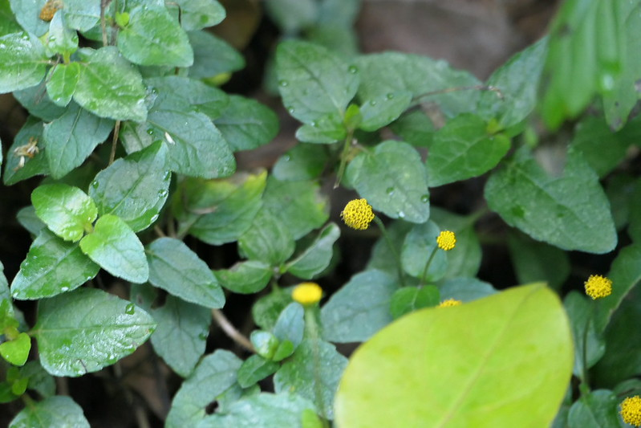

## Uses

### Food
Acmella paniculata can be used in Food. Leaves are cooked as vegetable and fl owers are eaten raw

## Parts Used
Leaf, Flower

## Chemical Composition

## Common names
| Language | Names |
| --- | --- |
| English | Panicled spot flower |
| Gujarati | Marethi |
| Kannada | ಆಚಾರ ಜೊಂಡಿ Achara jondi |
| Marathi | Akkalkara |

## Properties
Reference: Dravya - Substance, Rasa - Taste, Guna - Qualities, Veerya - Potency, Vipaka - Post-digesion effect, Karma - Pharmacological activity, Prabhava - Therepeutics.
### Dravya
### Rasa
### Guna
### Veerya
### Vipaka
### Karma
### Prabhava
### Nutritional components
Acmella paniculata Contains the Following nutritional components like - Vitamin-B1, B2, B3 and C; Alkaloids; Glycosides; Saponins; Steroids; Terpenoides, Gallic acid, Quercetin; Tannins; Calcium, Copper, Iron, Magnesium, Manganese, Potassium, Phosphorus, Sodium, Sulphur, Zinc

## Habit
## Identification
### Leaf

### Flower
### Fruit
### Other features
## List of Ayurvedic medicine in which the herb is used
## Where to get the saplings
## Mode of Propagation
## Cultivation Details
Acmella paniculata is available through September to January

## Commonly seen growing in areas

## Photo Gallery

## References

## External Links
* [ ]
* [ ]
* [ ]

## References

1. [Chemistry]
2. [Morphology]
3. Indian Medicinal Plants by C.P.Khare
4. "Forest food for Northern region of Western Ghats" by Dr. Mandar N. Datar and Dr. Anuradha S. Upadhye, Page No.16, Published by Maharashtra Association for the Cultivation of Science (MACS) Agharkar Research Institute, Gopal Ganesh Agarkar Road, Pune
5. **Daitota, P. S. Venkatarama. *Auṣadhīya Sasyagaḷu (ಔಷಧೀಯ ಸಸ್ಯಗಳು; Medicinal Plants)*. Vivekananda Samshodhana Kendra, Vivekananda Vidyavardhaka Sangha, Puttur, 2016, pp. 463-464.**
   Medicinal uses as mentioned in Daitota's Auṣadhīya Sasyagaḷu: presented as an anaesthetic-class pain reliever (nōvu nivārisuva anasthēsiyā). The author identifies the plant with the classical Sanskrit Ākarakāra-kara group — used in Ayurveda for dental pain. Flowering head used.
   > *As cited in: Ākarakāra-kara — classical Ayurvedic standing as dental analgesic (no specific text/verse cited)*
6. **Dinesh Valke. Photograph of *Acmella paniculata*. Flickr, CC BY-SA 4.0.** [Source](https://www.flickr.com/photos/dinesh_valke/55088817823)
