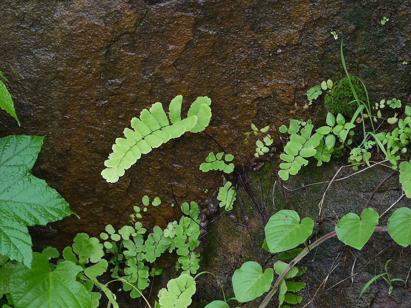

## Uses
Wounds, Chronic skin lesions.

## Parts Used
stem, leaves, Root.

## Chemical Composition

## Common names
## Properties
Reference: Dravya - Substance, Rasa - Taste, Guna - Qualities, Veerya - Potency, Vipaka - Post-digesion effect, Karma - Pharmacological activity, Prabhava - Therepeutics.
### Dravya
### Rasa
### Guna
### Veerya
### Vipaka
### Karma
### Prabhava
## Habit
## Identification
### Leaf

### Flower
### Fruit
### Other features
## List of Ayurvedic medicine in which the herb is used
## Where to get the saplings
## Mode of Propagation
## How to plant/cultivate

## Commonly seen growing in areas

## Photo Gallery

## References

## External Links
* [ ]
* [ ]
* [ ]

## References

1. ["chemistry"]
2. ["morphology"]
3. [ "Cultivation"]
4. **Daitota, P. S. Venkatarama. *Auṣadhīya Sasyagaḷu (ಔಷಧೀಯ ಸಸ್ಯಗಳು; Medicinal Plants)*. Vivekananda Samshodhana Kendra, Vivekananda Vidyavardhaka Sangha, Puttur, 2016, pp. 197-198.**
   Medicinal uses as mentioned in Daitota's Auṣadhīya Sasyagaḷu: presented as a quick wound-healer (gāyagaḷalli śīghra guṇakāri). Plant fronds and rhizome are used; the fern's spore powder is also used externally on chronic skin lesions. Wound dressing: fern fronds bruised with cold water, applied as external paste once daily, refreshed for 3–6 days.
5. **Dinesh Valke. Photograph of *Adiantum lunulatum*. Flickr, CC BY 2.0.** [Source](https://www.flickr.com/photos/dinesh_valke/3709411749)
