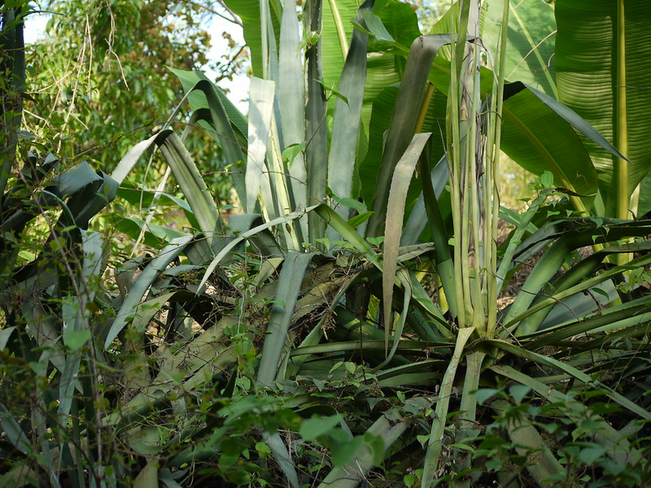

# Agave americana - Kantala

[TOC]

**Agave americana** is a large succulent plant of the Asparagaceae family. It has a powerful leaf rosette with gray-green or gray-blue leaves that can in tropical areas grow up to 1.75 meters long and 20 cm wide.
## Uses

## Parts Used
stem, leaves, Root.

## Chemical Composition

## Common names
## Properties
Reference: Dravya - Substance, Rasa - Taste, Guna - Qualities, Veerya - Potency, Vipaka - Post-digesion effect, Karma - Pharmacological activity, Prabhava - Therepeutics.
### Dravya
### Rasa
### Guna
### Veerya
### Vipaka
### Karma
### Prabhava
## Habit
## Identification
### Leaf

### Flower
### Fruit
### Other features
## List of Ayurvedic medicine in which the herb is used
## Where to get the saplings
## Mode of Propagation
## How to plant/cultivate

## Commonly seen growing in areas

## Photo Gallery

## References

## External Links
* [ ]
* [ ]
* [ ]

## References

1. ["Chemistry"]
2. ["Morphology"]
3. [ "Cultivation"]
4. Indian Medicinal Plants by C.P.Khare
5. **Dinesh Valke. Photograph of *Agave americana*. Flickr, CC BY 2.0.** [Source](https://www.flickr.com/photos/dinesh_valke/4745872028)
