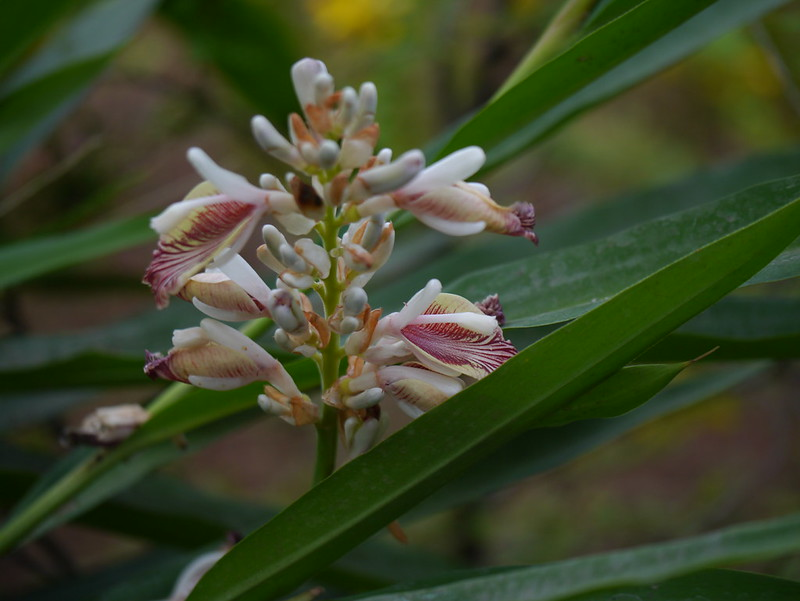

# Alpinia calcarata - Lesser Galangal, ರಾಸ್ನಗಡ್ಡೆ, Kulanjan, Sittarutthe, Rasna

[TOC]

**Alpinia calcarata** is a perennial herbaceous plant of the family Zingiberaceae, growing 1-2 m tall with highly aromatic rhizomes. It is found in the tropical and humid regions of South India, particularly in the Western Ghats and coastal Karnataka.

## Uses
Rheumatism, Fever, Indigestion, Cough, Cold, Skin diseases, Inflammation, Respiratory problems.

## Parts Used
Rhizome.

## Chemical Composition
The rhizome contains essential oils rich in 1,8-cineole, camphor, and other terpenoids.

## Common names
| Language | Names |
| --- | --- |
| Kannada | ರಾಸ್ನಗಡ್ಡೆ Rasnagadde, ರಸ್ಸೆ ಗಡ್ಡೆ Rasse Gadde |
| Sanskrit | Rasna |
| Hindi | Kulanjan |
| Tamil | Sittarutthe |
| Telugu | Chinne Dumparastamu |
| English | Lesser Galangal |

## Properties
Reference: Dravya - Substance, Rasa - Taste, Guna - Qualities, Veerya - Potency, Vipaka - Post-digesion effect, Karma - Pharmacological activity, Prabhava - Therepeutics.
### Dravya
### Rasa
Katu (Pungent)
### Guna
Laghu (Light), Teekshna (Sharp)
### Veerya
Ushna (Hot)
### Vipaka
Katu (Pungent)
### Karma
Vatahara (anti-Vata), Shothahara (anti-inflammatory)
### Prabhava

## Habit
Herb

## Identification
### Leaf
Simple, alternate, lanceolate, 30-60 cm long, pointed. Green with reddish tinge on stems.

### Flower
White with pink veins, arranged in terminal panicles.

### Fruit
Capsule, globose, red when ripe.

### Other features
Rhizomes are thick, aromatic, branching underground.

## List of Ayurvedic medicine in which the herb is used

## Where to get the saplings
## Mode of Propagation
Rhizome.

## How to plant/cultivate

Grows in moist sandy loam and clay loam soils in tropical humid regions. Naturally found in forests of South India, Western Ghats, and coastal Karnataka. Propagated through **rhizome pieces**. Plow land 1-3 times, add 10 tonnes FYM per hectare. Plant rhizome segments at 30 x 30 cm or 45 x 30 cm spacing. Use 3.5-5.5 tonnes planting material per hectare. Irrigate regularly, 4-5 times after planting during dry months. Weed monthly. No major pest or disease issues; use neem oil spray if needed. Harvest rhizomes after **18-24 months** when leaves turn yellow. Yield: 12 tonnes fresh rhizome per hectare; 4 tonnes dried per hectare. Economics: Rs. 200-250/kg; net profit Rs. 2,95,000 per hectare.

## Commonly seen growing in areas
Tropical and humid forests, Coastal Karnataka, Western Ghats.

## Photo Gallery

## References

1. **[KAMPA - ಔಷಧಿ ಸಸ್ಯಗಳ ಕೃಷಿ ಕೈಪಿಡಿ (Medicinal Plants Cultivation Handbook)](../resources/books/KAMPA_Medicinal_Plants_Cultivation_Handbook.md)**. Karnataka Medicinal Plants Authority (KAMPA), Bengaluru, 2024, pp. 37-39.
   Cultivation details including soil requirements, propagation methods, planting, irrigation, harvest timing, yield estimates, and economics.

## External Links
2. **Dinesh Valke. Photograph of *Alpinia calcarata*. Flickr, CC BY 2.0.** [Source](https://www.flickr.com/photos/dinesh_valke/27600913378)
