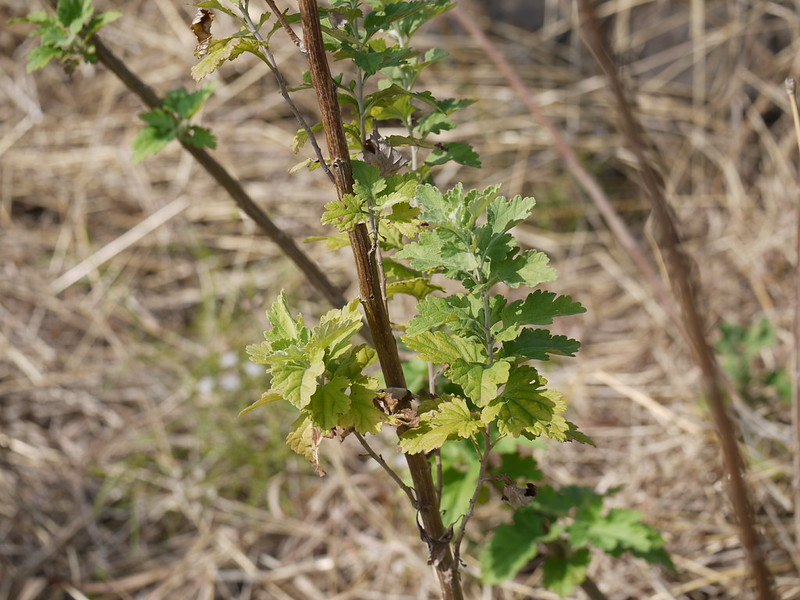

# Artemisia nilagirica - Indian wormwood, ಮಾಚಿಪತ್ರೆ, Damanak, Maci-pattiri, Davanamu, Ananta-pacca, Dhor davana

[TOC]

**Mugwort** is a perennial weed in the daisy family. It typically grows in loamy or sandy soils in forested areas, coastal strands and along roadsides and does not tolerate wet soils with poor drainage. It spreads by rhizomes and can form dense mats. This plant has been listed as invasive in several states.
## Uses

## Parts Used
Leaf.

## Chemical Composition

## Common names
| Language | Names |
| --- | --- |
| Sanskrit | Damanaka, Nagadamani |
| English | Indian wormwood, Nilgiri mugwort |
| Gujarati | Nagdaman |
| Hindi | Damanak, Dhyam |
| Kannada | ಮಾಚಿಪತ್ರೆ Machipatre |
| Malayalam | Ananta-pacca |
| Marathi | Dhor davana |
| Punjabi | Tatwen |
| Tamil | Maci-pattiri |
| Telugu | Davanamu |

## Properties
Reference: Dravya - Substance, Rasa - Taste, Guna - Qualities, Veerya - Potency, Vipaka - Post-digesion effect, Karma - Pharmacological activity, Prabhava - Therepeutics.
### Dravya
### Rasa
### Guna
### Veerya
### Vipaka
### Karma
### Prabhava
## Habit
## Identification
### Leaf

### Flower
Flowering from March to April

### Fruit
Fruiting from March to April

### Other features
## List of Ayurvedic medicine in which the herb is used
## Where to get the saplings
## Mode of Propagation
## How to plant/cultivate

## Commonly seen growing in areas

## Photo Gallery

## References

## External Links
* [ ]
* [ ]
* [ ]

## References

1. [Chemistry]
2. [Morphology]
3. [names](Common)(https://sites.google.com/site/indiannamesofplants/via-species/a/artemisia-nilagirica)
4. [Cultivation]
5. Indian Medicinal Plants by C.P.Khare
6. **Dinesh Valke. Photograph of *Artemisia nilagirica*. Flickr, CC BY 2.0.** [Source](https://www.flickr.com/photos/dinesh_valke/5254164477)
