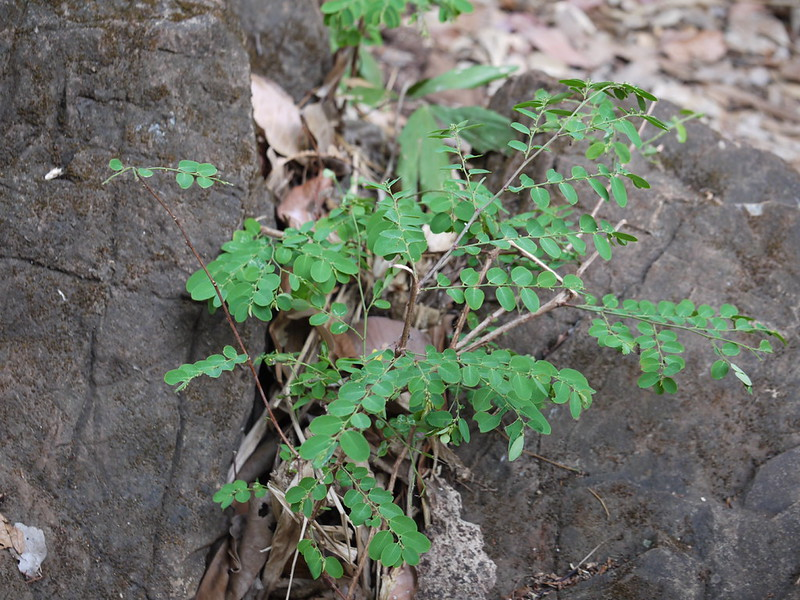

## Uses

## Parts Used
stem, leaves, Root.

## Chemical Composition

## Common names
| Language | Names |
| --- | --- |
| Sanskrit | Bahupraja, Bahupushpa |
| English | Cupped coral berry tree, Cup saucer plant |
| Gujarati | Kamboi |
| Hindi | Kaji, Khaja |
| Kannada | ಬಿಳೀಸುಲಿ Bilisuli |
| Malayalam | Perunniruri |
| Marathi | Asana |
| Tamil | Mullu-Vengai |
| Telugu | Kora maddi |

## Properties
Reference: Dravya - Substance, Rasa - Taste, Guna - Qualities, Veerya - Potency, Vipaka - Post-digesion effect, Karma - Pharmacological activity, Prabhava - Therepeutics.
### Dravya
### Rasa
### Guna
### Veerya
### Vipaka
### Karma
### Prabhava
## Habit
## Identification
### Leaf

### Flower
### Fruit
### Other features
## List of Ayurvedic medicine in which the herb is used
## Where to get the saplings
## Mode of Propagation
## How to plant/cultivate

## Commonly seen growing in areas

## Photo Gallery

## References

## External Links
* [ ]
* [ ]
* [ ]

## References

1. [Chemistry]
2. [Morphology]
3. [Cultivation]
4. Indian Medicinal Plants by C.P.Khare
5. [names](Common)(http://www.flowersofindia.net/catalog/slides/Spinous%20Kino%20Tree.html)
6. **Dinesh Valke. Photograph of *Breynia retusa*. Flickr, CC BY 2.0.** [Source](https://www.flickr.com/photos/dinesh_valke/8893512265)
