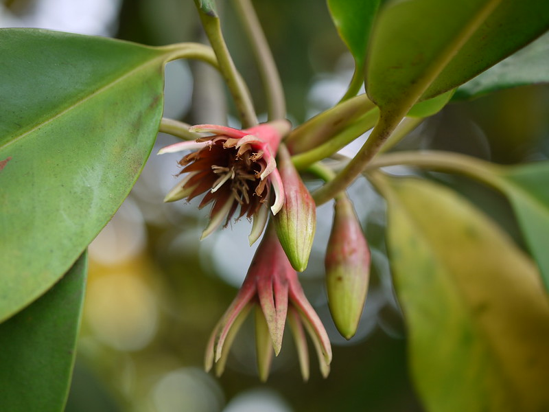

## Uses

## Parts Used
stem, leaves, Root.

## Chemical Composition

## Common names
| Language | Names |
| --- | --- |
| English | Black mangrove, Burma mangrove |
| Gujarati | Sanavar |
| Kannada | ಕೊಳಚೆ ಗಿಡ Kolache gida |
| Malayalam | Kantal |
| Marathi | Zumbar |
| Tamil | Sigapukokandam |
| Telugu | Dudduponna |

## Properties
Reference: Dravya - Substance, Rasa - Taste, Guna - Qualities, Veerya - Potency, Vipaka - Post-digesion effect, Karma - Pharmacological activity, Prabhava - Therepeutics.
### Dravya
### Rasa
### Guna
### Veerya
### Vipaka
### Karma
### Prabhava
## Habit
## Identification
### Leaf

### Flower
### Fruit
### Other features
## List of Ayurvedic medicine in which the herb is used
## Where to get the saplings
## Mode of Propagation
## How to plant/cultivate

## Season to grow
Mansson.

## Required Ecosystem/Climate
It is characteristic of the landward side of mangroves and can grow along the river beds upward as far as the tidal range.

## Kind of soil needed
It usually grows on somewhat dry, well-aerated soil but also on mud, sand and occasionally black, peaty soils.

## Commonly seen growing in areas

## Photo Gallery

## References

## External Links
* [ ]
* [ ]
* [ ]

## References

1. [Chemistry]
2. [Morphology]
3. [Cultivation]
4. Indian Medicinal Plants by C.P.Khare
5. [Ecosystem/Climate](Required)(https://uses.plantnet-project.org/en/Bruguiera_gymnorhiza_(PROTA))
6. **Dinesh Valke. Photograph of *Bruguiera gymnorrhiza*. Flickr, CC BY 2.0.** [Source](https://www.flickr.com/photos/dinesh_valke/7211154640)
