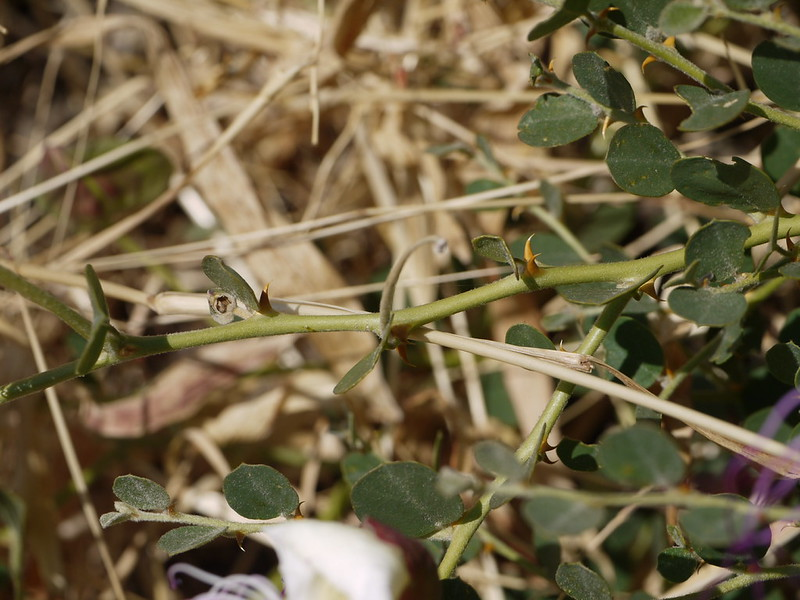

# Capparis spinosa - Ceper Plant, Kabara, Jeevakamu

[TOC]

**Hiṃsrā** consists of root of Capparis spinosa Linn. (Fam. Capparidaceae), a thorny shrub distributed in the plains, lower Himalayas, and Western Ghats.

## Uses
Flatulence, Antirheumatic, Gastrointestinal infections, Diarrhoea, Dropsy, Anaemia, Arthritis, Gout, Rheumatism, Capillary weakness.

### Food
Capparis spinosa can be used in food. Cooked as vegetable.

## Parts Used
Young fruits, Flower buds, Small leaves.

## Chemical Composition
The roots contain alkaloid stachydrine. Glucobrassicin, neoglucobrassicin and 4-methoxyglucobrassicin have also been identified in the roots.

## Common names
| Language | Names |
| --- | --- |
| Sanskrit | Hiṃsrā, Kaṇṭhārī, Tīkṣṇa, Kaṇṭakā, Tikṣṇagandhā |
| Telugu | Jeevakamu |
| Hindi | Kabara, Hainsaa, Kanthara |
| English | Ceper Plant |

## Properties
Reference: Dravya - Substance, Rasa - Taste, Guna - Qualities, Veerya - Potency, Vipaka - Post-digesion effect, Karma - Pharmacological activity, Prabhava - Therepeutics.
### Dravya
### Rasa
Tikta, Kaṭu
### Guna
Rūkṣa, Laghu
### Veerya
Uṣṇa
### Vipaka
Kaṭu
### Karma
Vātahara, Kaphahara, Dīpana,  Rucya
### Prabhava
### Nutritional components
Himsra contains the Following nutritional components like Vitamin-C; Phenolic content; Calcium, Iron, Manganese, Magnesium, Phosphorus, Potassium, Sodium

## Habit
Evergreen shrub

## Identification
### Leaf
Paripinnate, Oblong, Leaf Arrangementis Alternate-spiral

### Flower
Unisexual, 2-4cm long, Pink, Flowering throughout the year and In terminal and/or axillary pseudoracemes

### Fruit
Oblong pod, Thinly septate, pilose, wrinkled, Seeds upto 5, Fruiting throughout the year

### Other features
## List of Ayurvedic medicine in which the herb is used
* Amṛātādi Taila, Kuṭikhādi Vaṭikā, Hiṃsrādya Gṛta

## Where to get the saplings
## Mode of Propagation
Seeds, Cuttings.

## How to plant/cultivate
Capparis spinosa is a plant of drier warm temperate areas with hot summers, extending through the subtropics to tropical areas. Capers  can  be grown  easily  from  fresh  seeds gathered  from ripe  fruit  and  planted  into  well  drained seed-raising mix. Seedlings will appear in 2–4  weeks. Capparis spinosa is available through December to March

## Commonly seen growing in areas
Old walls, Cliffs, Rocky hillsides.

## Photo Gallery

## References

## External Links
* [Capparis spinosa Linn on plantnet-project.org](https://uses.plantnet-project.org/en/Capparis_spinosa_(PROSEA))
* [Capparis spinosa Linn on www.drugs.com](https://www.drugs.com/npp/capers.html)
* [Capparis spinosa Linn on natural medicinal herbs.net](http://www.naturalmedicinalherbs.net/herbs/c/capparis-spinosa=caper.php)
* [Capparis spinosa Linn on pfaf.org](https://pfaf.org/user/Plant.aspx?LatinName=capparis+spinosa)

## References

1. The Ayuredic Pharmacopoeia of India Part-1, Volume-5, Page no-72
2. [Morphology]
3. [detail](Cultivation)(https://www.researchgate.net/publication/286127652_Capparis_spinosa_L_Propagation_and_Medicinal_uses)
4. Forest food for Northern region of western ghat pdf by Dr. Mandar N. Datar and Dr. Anuradha S. Upadhye, MACS - Agharkar Research Institute, Pune
5. **Dinesh Valke. Photograph of *Capparis spinosa*. Flickr, CC BY 2.0.** [Source](https://www.flickr.com/photos/dinesh_valke/6720216305)
