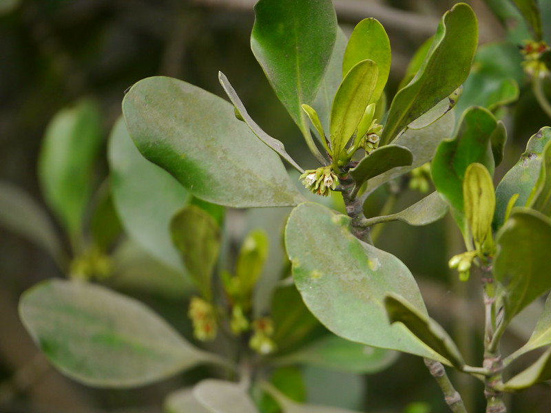

## Uses

## Parts Used
stem, leaves, Root.

## Chemical Composition

## Common names
| Language | Names |
| --- | --- |
| English | Compound-cymed mangrove, Spurred mangrove |
| Gujarati | Kanari |
| Kannada | ಚೌರಿ Chowri, ಕಿರಾರಿ Kiraari |
| Malayalam | Aanakkantal, Kantal |
| Marathi | Chauri, Kirari |
| Tamil | Panri-k-kutti |
| Telugu | Gedara |

## Properties
Reference: Dravya - Substance, Rasa - Taste, Guna - Qualities, Veerya - Potency, Vipaka - Post-digesion effect, Karma - Pharmacological activity, Prabhava - Therepeutics.
### Dravya
### Rasa
### Guna
### Veerya
### Vipaka
### Karma
### Prabhava
## Habit
## Identification
### Leaf

### Flower
### Fruit
### Other features
## List of Ayurvedic medicine in which the herb is used
## Where to get the saplings
## Mode of Propagation
## How to plant/cultivate

## Commonly seen growing in areas

## Photo Gallery

## References

## External Links
* [ ]
* [ ]
* [ ]

## References

1. [constituents](Chemical)
2. [Morphology]
3. [details](Cultivation)
4. Indian Medicinal Plants by C.P.Khare
5. **Dinesh Valke. Photograph of *Ceriops tagal*. Flickr, CC BY 2.0.** [Source](https://www.flickr.com/photos/dinesh_valke/48149860742)
