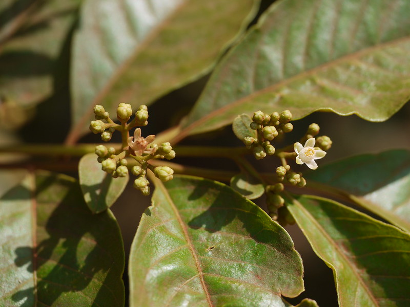

## Uses
Lymphatic glands.

## Parts Used
stem, leaves, Root.

## Chemical Composition

## Common names
| Language | Names |
| --- | --- |
| English | Globular-flowered neem, Hill neem |
| Kannada | ಬೆಟ್ಟದ ಬೇವು Bettada bevu, ಚೇಡುಬೀರ Chedubira |
| Malayalam | Kaippanaranci |
| Marathi | Gudmi |
| Tamil | Cevvattai |
| Telugu | Chedu bira |

## Properties
Reference: Dravya - Substance, Rasa - Taste, Guna - Qualities, Veerya - Potency, Vipaka - Post-digesion effect, Karma - Pharmacological activity, Prabhava - Therepeutics.
### Dravya
### Rasa
### Guna
### Veerya
### Vipaka
### Karma
### Prabhava
## Habit
## Identification
### Leaf

### Flower
### Fruit
### Other features
## List of Ayurvedic medicine in which the herb is used
## Where to get the saplings
## Mode of Propagation
## How to plant/cultivate

## Commonly seen growing in areas

## Photo Gallery

## References

## External Links
* [ ]
* [ ]
* [ ]

## References

1. ["Chemistry"]
2. ["Morphology"]
3. [ "Cultivation"]
4. Indian Medicinal Plants by C.P.Khare
5. **Daitota, P. S. Venkatarama. *Auṣadhīya Sasyagaḷu (ಔಷಧೀಯ ಸಸ್ಯಗಳು; Medicinal Plants)*. Vivekananda Samshodhana Kendra, Vivekananda Vidyavardhaka Sangha, Puttur, 2016, p. 400.**
   Medicinal uses as mentioned in Daitota's Auṣadhīya Sasyagaḷu: presented as a remedy for lymphatic glands (rasa-granthi bāvige). All parts used. Lymphatic swellings: bark-and-leaf paste applied as external lepa for 2–3 hours; 3 days.
6. **Dinesh Valke. Photograph of *Cipadessa baccifera*. Flickr, CC BY 2.0.** [Source](https://www.flickr.com/photos/dinesh_valke/5654167850)
