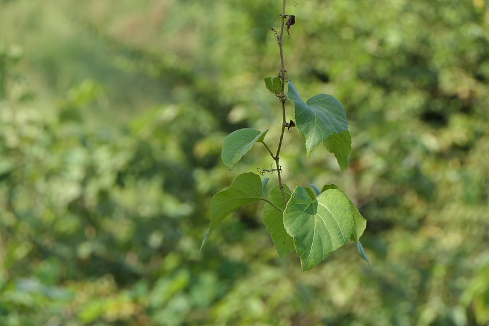

## Uses

### Food
Cissus repanda can be used in Food. Whole plant is used in preparation of health drink. Stem yields drinkable water.

## Parts Used
Whole plant.

## Chemical Composition

## Common names
| Language | Names |
| --- | --- |
| English | Wavy-leaved cissus |
| Gujarati | Gando velo |
| Hindi | Pani bel |
| Kannada | ಎಲೆಕೊಂಬು ಬಳ್ಳಿ Elekombu balli, ಮುಡಿ ಬಳ್ಳಿ Mudi balli |
| Marathi | Gendal |
| Telugu | Gummadi thige |

## Properties
Reference: Dravya - Substance, Rasa - Taste, Guna - Qualities, Veerya - Potency, Vipaka - Post-digesion effect, Karma - Pharmacological activity, Prabhava - Therepeutics.
### Dravya
### Rasa
### Guna
### Veerya
### Vipaka
### Karma
### Prabhava
### Nutritional components
Cissus repanda Contains the Following nutritional components like - Vitamin-C; Calcium, Copper, Iron, Magnesium, Manganese, Potassium, Sodium, Zinc.

## Habit
## Identification
### Leaf

### Flower
### Fruit
### Other features
## List of Ayurvedic medicine in which the herb is used
## Where to get the saplings
## Mode of Propagation
## Cultivation Details
Cissus repanda is available from March to June.

## Commonly seen growing in areas
Dry deciduous forests.

## Photo Gallery

## References
<references>

## External Links
* [ ]
* [ ]
* [ ]

## References

1. [Chemistry]
2. [Morphology]
3. [names](Common)(https://sites.google.com/site/indiannamesofplants/via-species/c/cissus-repanda)
4. Indian Medicinal Plants by C.P.Khare
5. "Forest food for Northern region of Western Ghats" by Dr. Mandar N. Datar and Dr. Anuradha S. Upadhye, Page No.55, Published by Maharashtra Association for the Cultivation of Science (MACS) Agharkar Research Institute, Gopal Ganesh Agarkar Road, Pune
6. **Dinesh Valke. Photograph of *Cissus repanda*. Flickr, CC BY 2.0.** [Source](https://www.flickr.com/photos/dinesh_valke/51641830441)
