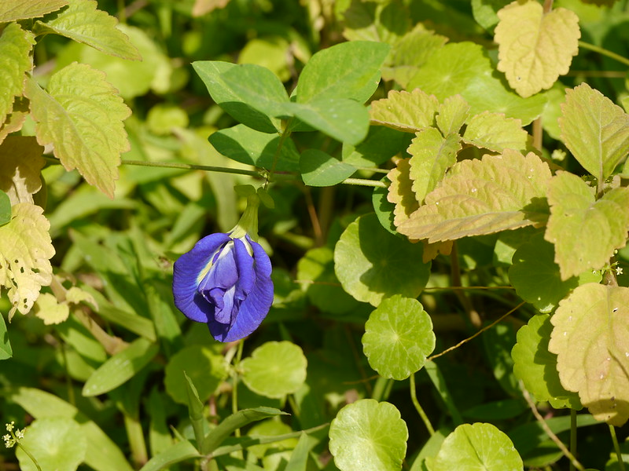

# Clitoria ternatea - Kounch flower, Kanti soppu, Aparaajit, Shankapushpam, Shankapushpmamu, Gokarni

[TOC]

**Clitoria ternatea** is a vigorous, trailing, scrambling or climbing vine with a strong woody rootstock belonging to the family Fabaceae. The plant is native to equatorial Asia, including locations the Indian sub-continent and Southeast Asia but has also been introduced to Africa, Australia and America.
## Uses
Scorpion bite, Cough, Fever, Skin problems, Eye problems

## Parts Used
Root, Leaf, Flower

## Chemical Composition
The  preliminary phytochemical screening showed  that the plant contained  Tannins, Phlobatannin, Carbohydrates, Saponins, Triterpenoids, Phenols, Flavanoids etc

## Common names
| Language | Names |
| --- | --- |
| Sanskrit | Aparaajita, Girikarnika |
| English | Kounch flower |
| Gujarati | Garnee |
| Hindi | Aparaajit |
| Kannada | Kanti soppu, Giri kannike |
| Malayalam | Shankapushpam |
| Marathi | Gokarni |
| Tamil | Shankapushpam |
| Telugu | Shankapushpmamu |

## Properties
Reference: Dravya - Substance, Rasa - Taste, Guna - Qualities, Veerya - Potency, Vipaka - Post-digesion effect, Karma - Pharmacological activity, Prabhava - Therepeutics.
### Dravya
### Rasa
Katu, Tikta, Kashaaya
### Guna
Laghu, Rooksha
### Veerya
Sheeta
### Vipaka
Katu
### Karma
### Prabhava

## Habit
## Identification
### Leaf

### Flower
Flowering Throughout the year

### Fruit
Fruiting Throughout the year

### Other features
## List of Ayurvedic medicine in which the herb is used
[Suvarnamukta](../medicines/Suvarnamukta.md)

## Where to get the saplings
## Mode of Propagation
## How to plant/cultivate

## Commonly seen growing in areas

## Photo Gallery

## References

## External Links
* [Health benefits of Clitoria ternatea](https://www.medicinenet.com/8_health_benefits_of_blue_clitoria_ternate/article.htm)
* [Clitoria ternatea on Planet ayureda](https://www.planetayurveda.com/library/aparajita-clitoria-ternatea/)
* [Clitoria ternatea on India Medicinal plants website](https://theindianmed.com/sangu-poo-clitoria-ternatea-benefits-medicinal-uses/)

## References

1. IOSR Journal Of Pharmacy, Author - Prof  Dr Ali Esmail Al-Snafi
2. [Morphology]
3. [Cultivation]
4. Indian Medicinal Plants by C.P.Khare
5. Planet Ayurveda
6. **Gurudeva, Magadi R. *Karnatakada Aushadhiya Sasyagalu (Vol. 2)*. Divyachandra Prakashana, Bengaluru, 2016, p. 247.**
   The plant is a renowned brain tonic (Medhya Rasayana) in Ayurveda, used to improve memory and cognitive function. Root paste is used for treating alopecia and hair problems. The plant has demonstrated anti-diabetic properties, lowering serum sugar levels, and has cholinergic activity that enhances m. 3 grams root powder with half cup milk twice daily for memory; root paste applied externally for skin conditions; leaf decoction taken for 8-10 days for various conditions.
7. **Dinesh Valke. Photograph of *Clitoria ternatea*. Flickr, CC BY 2.0.** [Source](https://www.flickr.com/photos/dinesh_valke/40124513630)
