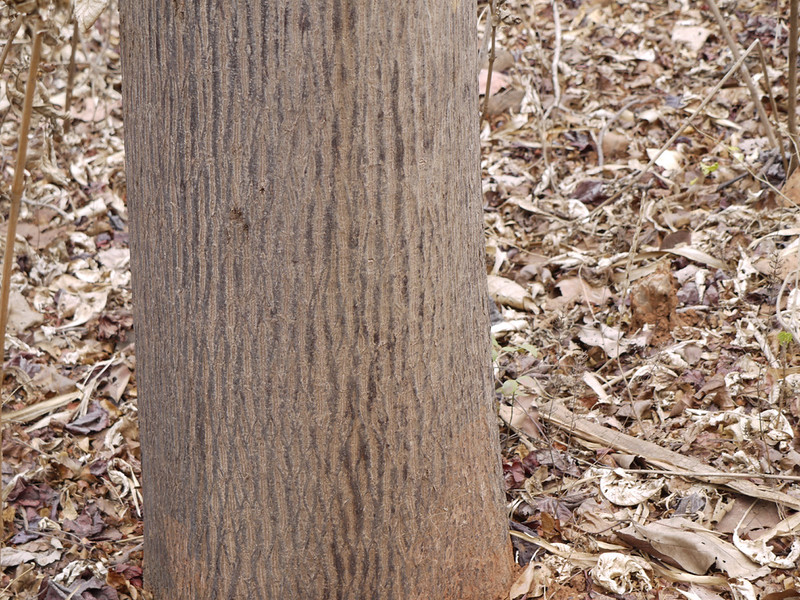

# Cochlospermum religiosum - Buttercup tree, ಅರಿಸಿನ ಬೂರುಗ, Galgal, Kattupparutti, Konda gogu, Cempanni, Ganeri

[TOC]

**Katira** is a small, rather crooked-branched, more or less deciduous tree growing about 7 metres tall. The plant is used locally for the its gum. Considered a sacred tree in its native range, it is often cultivated near temples where the flowers are used as temple offerings.
## Uses
Coughs, Gonorrhoea.

### Food
Cochlospermum religiosum can be used in Food. Gum which is known as Kathalya gum is used in some food preparations. Tender fruits are cooked as
vegetable. Roasted seeds are eaten.

## Parts Used
Seeds, Gum.

## Chemical Composition

## Common names
| Language | Names |
| --- | --- |
| English | Buttercup tree |
| Hindi | Galgal |
| Kannada | ಅರಿಸಿನ ಬೂರುಗ Arasina buruga |
| Malayalam | Cempanni |
| Marathi | Ganeri |
| Tamil | Kattupparutti |
| Telugu | Konda gogu |

## Properties
Reference: Dravya - Substance, Rasa - Taste, Guna - Qualities, Veerya - Potency, Vipaka - Post-digesion effect, Karma - Pharmacological activity, Prabhava - Therepeutics.
### Dravya
### Rasa
### Guna
### Veerya
### Vipaka
### Karma
### Prabhava
### Nutritional components
Cochlospermum religiosum Contains the Following nutritional components like - Oligosaccharides including D-galactose, D-galactouronic acid; Calcium, Iron, Magnesium, Manganese, Phosphorus, Potassium, Sodium.

## Habit
Deciduous tree

## Identification
### Leaf

### Flower
### Fruit
### Other features
## List of Ayurvedic medicine in which the herb is used
## Where to get the saplings
## Mode of Propagation
Seeds, Cuttings of leafy shoots.

## Cultivation Details
Succeeds in a well-drained but moisture-retentive soil and a sunny position. Cochlospermum religiosum is available through February to May

## Commonly seen growing in areas
Cultivated ground, On dry forests, Especially on stony hills.

## Photo Gallery

## References

## External Links
* [Cochlospermum religiosum on flowersofindia.net](http://www.flowersofindia.net/catalog/slides/Buttercup%20Tree.html#:~:text=The%20flowers%20of%20the%20Buttercup,The%20stamens%20are%20orange.&text=Religiosum%20because%20the%20flowers%20are%20used%20as%20temple%20offerings.)

## References

1. [Chemistry]
2. [Morphology]
3. **Gurudeva, Magadi R. *Karnatakada Aushadhiya Sasyagalu*. Divyachandra Prakashana, Bengaluru, 2017, p. 23.**
   1. Leaf juice applied on the scalp helps treat dandruff and headache. 2. Gum (Bondi) dissolved in buttermilk and consumed helps treat diarrhea and blood-related disorders. 3. Gum (Bondi) dissolved in water, mixed with alum, and used as a gargle helps relieve throat and gum pain. 4. Leaf and flower j. Leaf juice applied topically on the scalp. Gum dissolved in buttermilk for diarrhea. Gum dissolved in water with alum as a gargle solution.
4. Indian Medicinal Plants by C.P.Khare
5. "Forest food for Northern region of Western Ghats" by Dr. Mandar N. Datar and Dr. Anuradha S. Upadhye, Page No.59, Published by Maharashtra Association for the Cultivation of Science (MACS) Agharkar Research Institute, Gopal Ganesh Agarkar Road, Pune
6. **Dinesh Valke. Photograph of *Cochlospermum religiosum*. Flickr, CC BY 2.0.** [Source](https://www.flickr.com/photos/dinesh_valke/3602272045)
