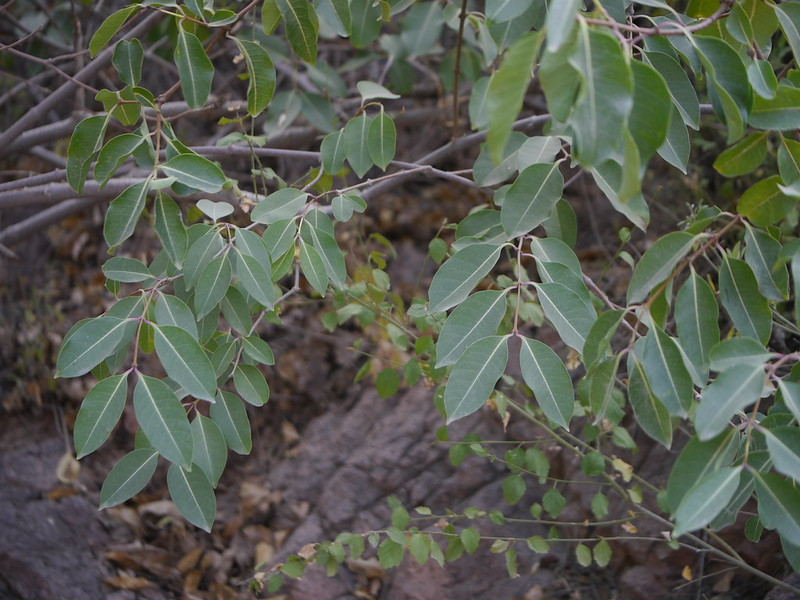

# Cryptostegia Grandiflora - Rubber vine, Hambu rubber gida

[TOC]

**Cryptostegia Grandiflora** is a self supporting, scrambling, Many-stemmed vine that grows upto 2 metres tall with long trailing whips.
## Uses

## Parts Used

## Chemical Composition

## Common names
| Language | Names |
| --- | --- |
| English | Rubber vine |
| Kannada | Hambu rubber gida |

## Properties
Reference: Dravya - Substance, Rasa - Taste, Guna - Qualities, Veerya - Potency, Vipaka - Post-digesion effect, Karma - Pharmacological activity, Prabhava - Therepeutics.
### Dravya
### Rasa
### Guna
### Veerya
### Vipaka
### Karma
### Prabhava
## Habit
## Identification
### Leaf
Dark green and glosy, 6-10cm long, 3-5cm wide and opposite pairs, Oblong-ovate to elliptic ovate

### Flower
Large, White, 5 white to light purple petals in a funnal shape

### Fruit
Pods, Rigid, 10-12cm long, 3-4cm wide, Fruits will grow in pairs at the end of the short stalk

### Other features
## List of Ayurvedic medicine in which the herb is used
## Where to get the saplings
## Mode of Propagation
## How to plant/cultivate

## Commonly seen growing in areas

## Photo Gallery

## References

## External Links
* [ ]
* [ ]
* [ ]

## References

1. [Chemistry]
2. Kappatagudda - A Repertoire of  Medicianal Plants of Gadag by Yashpal Kshirasagar and Sonal Vrishni, Page No. 147
3. [Cultivation]
4. **Dinesh Valke. Photograph of *Cryptostegia Grandiflora*. Flickr, CC BY 2.0.** [Source](https://www.flickr.com/photos/dinesh_valke/45597343942)
