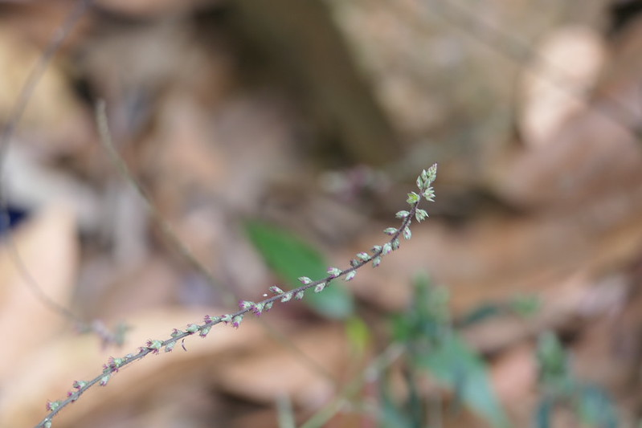

# Cyathula prostrata - Cyathula, ನೆಲ ಉತ್ತರಾಣಿ, Lal chirchita, Civappu nayuruvi, Cerukadalaadi, Bhuiaghaada

[TOC]

**Cyathula prostrata** is a perennial, slender herb, prostrate below and rooting at the nodes, branches ascending.
## Uses
Excessive menstrual bleeding.

## Parts Used
stem, leaves, Root.

## Chemical Composition

## Common names
| Language | Names |
| --- | --- |
| English | Cyathula, Prostrate pastureweed |
| Hindi | Lal chirchita |
| Kannada | ನೆಲ ಉತ್ತರಾಣಿ Nela uttharaani, ರಕ್ತಪಮರ್ಗ Raktapamarga |
| Malayalam | Cerukadalaadi |
| Marathi | Bhuiaghaada |
| Tamil | Civappu nayuruvi |

## Properties
Reference: Dravya - Substance, Rasa - Taste, Guna - Qualities, Veerya - Potency, Vipaka - Post-digesion effect, Karma - Pharmacological activity, Prabhava - Therepeutics.
### Dravya
### Rasa
### Guna
### Veerya
### Vipaka
### Karma
### Prabhava
## Habit
## Identification
### Leaf
Opposite, 2-6cm long, 1.3cm wide and It is Rhomboid ovate to elliptic

### Flower
Pale pink to Voilate, Laterally subtended by imperfect flowers, upper flowers solitary

### Fruit
### Other features
## List of Ayurvedic medicine in which the herb is used
## Where to get the saplings
## Mode of Propagation
## How to plant/cultivate

## Commonly seen growing in areas

## Photo Gallery

## References

## External Links
* [ ]
* [ ]
* [ ]

## References

1. ["Chemistry"]
2. Kappatagudda - A Repertoire of  Medicianal Plants of Gadag by Yashpal Kshirasagar and Sonal Vrishni, Page No. 154
3. [names](Common)(https://sites.google.com/site/indiannamesofplants/via-species/c/cyathula-prostrata)
4. [ "Cultivation"]
5. Indian Medicinal Plants by C.P.Khare
6. **Daitota, P. S. Venkatarama. *Auṣadhīya Sasyagaḷu (ಔಷಧೀಯ ಸಸ್ಯಗಳು; Medicinal Plants)*. Vivekananda Samshodhana Kendra, Vivekananda Vidyavardhaka Sangha, Puttur, 2016, pp. 168-169.**
   Medicinal uses as mentioned in Daitota's Auṣadhīya Sasyagaḷu: presented as a simple remedy for sudden/acute complaints in women — particularly excessive menstrual bleeding and related female complaints. Excessive menstruation: <needs-edit>
7. **Dinesh Valke. Photograph of *Cyathula prostrata*. Flickr, CC BY 2.0.** [Source](https://www.flickr.com/photos/dinesh_valke/53526696979)
