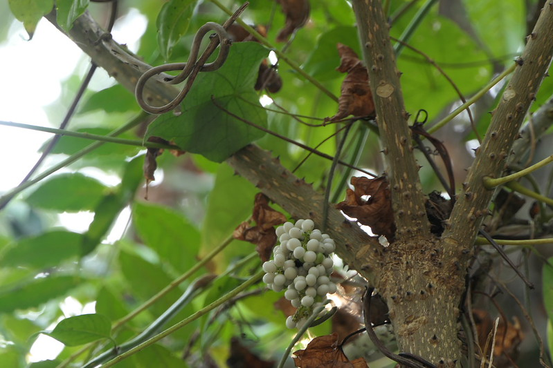

# Cyclea peltata - Indian moon seed, Padaavala, Pata, Padathali, Paka

[TOC]

*'Indian Moon-Seed* is a slender twining shrub, frequently climbing up on tall trees.
## Uses
Infected wounds, Sinuses, Skin diseases, Serpant bite, Headache.

## Parts Used
Roots, Leaves.

## Chemical Composition

## Common names
| Language | Names |
| --- | --- |
| Sanskrit | Bruhat Patha |
| English | Indian moon seed |
| Kannada | Padaavala |
| Malayalam | Padathali, Padavali |
| Marathi | Paka |
| Tamil | Pata |

## Properties
Reference: Dravya - Substance, Rasa - Taste, Guna - Qualities, Veerya - Potency, Vipaka - Post-digesion effect, Karma - Pharmacological activity, Prabhava - Therepeutics.
### Dravya
### Rasa
### Guna
### Veerya
### Vipaka
### Karma
### Prabhava
## Habit
## Identification
### Leaf

### Flower
### Fruit
### Other features
## List of Ayurvedic medicine in which the herb is used
## Where to get the saplings
## Mode of Propagation
## How to plant/cultivate

## Commonly seen growing in areas

## Photo Gallery

## References

## External Links
* [ ]
* [ ]
* [ ]

## References

1. [Chemistry]
2. [Morphology]
3. [Cultivation]
4. **Daitota, P. S. Venkatarama. *Auṣadhīya Sasyagaḷu (ಔಷಧೀಯ ಸಸ್ಯಗಳು; Medicinal Plants)*. Vivekananda Samshodhana Kendra, Vivekananda Vidyavardhaka Sangha, Puttur, 2016, p. 73.**
   Medicinal uses as mentioned in Daitota's Auṣadhīya Sasyagaḷu: presented as a remedy for rectal prolapse (guda-bhraṁśa nivāraka). Root paste is applied around the prolapsed anus to encourage retraction; root decoction is taken internally for chronic dysentery and as a postnatal tonic.
5. **Dinesh Valke. Photograph of *Cyclea peltata*. Flickr, CC BY 2.0.** [Source](https://www.flickr.com/photos/dinesh_valke/52535572869)
