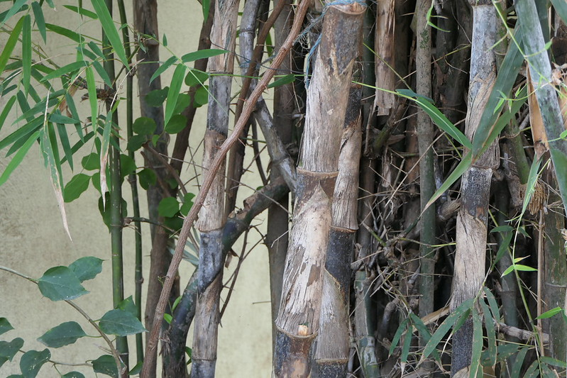

## Uses

### Food
Dendrocalamus strictus can be used in Food. Young shoots are cooked as vegetable or pickled. Grains are eaten as cereals.

## Parts Used
Shoots, Grains.

## Chemical Composition

## Common names
| Language | Names |
| --- | --- |
| Sanskrit | Vansh, Venu |
| English | Boar spear, Calcutta bamboo |
| Gujarati | Nakor vans, Narvans |
| Hindi | Nar bans |
| Kannada | ಗಂಡುಬಿದುರು Gandubiduru |
| Malayalam | Kallanmula |
| Tamil | Ciru-munkil, Kal-munkil |
| Telugu | Chitti veduru, Gatti veduru |

## Properties
Reference: Dravya - Substance, Rasa - Taste, Guna - Qualities, Veerya - Potency, Vipaka - Post-digesion effect, Karma - Pharmacological activity, Prabhava - Therepeutics.
### Dravya
### Rasa
### Guna
### Veerya
### Vipaka
### Karma
### Prabhava
### Nutritional components
Dendrocalamus strictus Contains the Following nutritional components like - Vitamin-A, B1, B3, B6 and E; Calcium, Iron, Magnesium, Manganese, Phosphorus, Potassium, Sodium.

## Habit
## Identification
### Leaf

### Flower
### Fruit
### Other features
## List of Ayurvedic medicine in which the herb is used
## Where to get the saplings
## Mode of Propagation
## Cultivation Details
Dendrocalamus strictus is available through October to March.

## Commonly seen growing in areas
Semi-evergreen forests, Deciduous forests.

## Photo Gallery

## References

## External Links
* [ ]
* [ ]
* [ ]

## References

1. [Chemistry]
2. ["Morphology"]
3. [names"]("Common)(https://sites.google.com/site/indiannamesofplants/via-species/d/dendrocalamus-strictus)
4. Indian Medicinal Plants by C.P.Khare
5. "Forest food for Northern region of Western Ghats" by Dr. Mandar N. Datar and Dr. Anuradha S. Upadhye, Page No.64, Published by Maharashtra Association for the Cultivation of Science (MACS) Agharkar Research Institute, Gopal Ganesh Agarkar Road, Pune
6. **Dinesh Valke. Photograph of *Dendrocalamus strictus*. Flickr, CC BY 2.0.** [Source](https://www.flickr.com/photos/dinesh_valke/51696539107)
