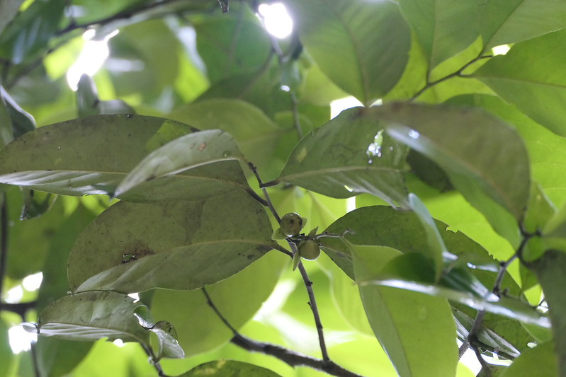

## Uses

## Parts Used
stem, leaves, Root.

## Chemical Composition

## Common names
| Language | Names |
| --- | --- |
| Sanskrit | Tinduka |
| English | Panicle-flowered ebony |
| Kannada | ಕರೆ ಮರ Kare mara |
| Malayalam | Illekatta, Kari |
| Marathi | Temburni |
| Tamil | Kari, Karu-n-tuvarai |

## Properties
Reference: Dravya - Substance, Rasa - Taste, Guna - Qualities, Veerya - Potency, Vipaka - Post-digesion effect, Karma - Pharmacological activity, Prabhava - Therepeutics.
### Dravya
### Rasa
### Guna
### Veerya
### Vipaka
### Karma
### Prabhava
## Habit
Tree

## Identification
### Leaf

### Flower
### Fruit
### Other features
## List of Ayurvedic medicine in which the herb is used
## Where to get the saplings
## Mode of Propagation
## How to plant/cultivate

## Commonly seen growing in areas
Tropical evergreen forests, Tropical semi-evergreen forests.

## Photo Gallery

## References

## External Links
* [ ]
* [ ]
* [ ]

## References

1. ["Chemistry"]
2. ["Morphology"]
3. [ "Cultivation"]
4. Indian Medicinal Plants by C.P.Khare
5. **Dinesh Valke. Photograph of *Diospyros paniculata Dalzell*. Flickr, CC BY 2.0.** [Source](https://www.flickr.com/photos/dinesh_valke/54583624887)
