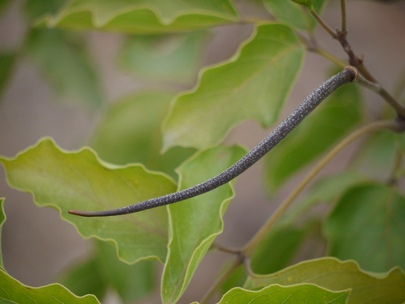

# Dolichandrone atrovirens - Caralluma

[TOC]

**Dolichandrone atrovirens**  is a deciduous tree. It can grow upto 16m tall. Branchless are valvet hairy.
## Uses

## Parts Used

## Chemical Composition

## Common names
| Language | Names |
| --- | --- |
| Kannada | Caralluma |

## Properties
Reference: Dravya - Substance, Rasa - Taste, Guna - Qualities, Veerya - Potency, Vipaka - Post-digesion effect, Karma - Pharmacological activity, Prabhava - Therepeutics.
### Dravya
### Rasa
### Guna
### Veerya
### Vipaka
### Karma
### Prabhava
## Habit
## Identification
### Leaf
Pinnately compound, Its size is 10cm long, Carried on 5-6cm long stalk

### Flower
White, Borne in cymes in leaf axils

### Fruit
Capsule, It's size is 15cm long, Brown, Ribbed

### Other features
## List of Ayurvedic medicine in which the herb is used
## Where to get the saplings
## Mode of Propagation
## How to plant/cultivate

## Commonly seen growing in areas

## Photo Gallery

## References

## External Links
* [ ]
* [ ]
* [ ]

## References

1. [Chemistry]
2. Kappatagudda - A Repertoire of  Medicianal Plants of Gadag by Yashpal Kshirasagar and Sonal Vrishni, Page No. 172
3. [Cultivation]
4. **Dinesh Valke. Photograph of *Dolichandrone atrovirens*. Flickr, CC BY 2.0.** [Source](https://www.flickr.com/photos/dinesh_valke/5780560713)
