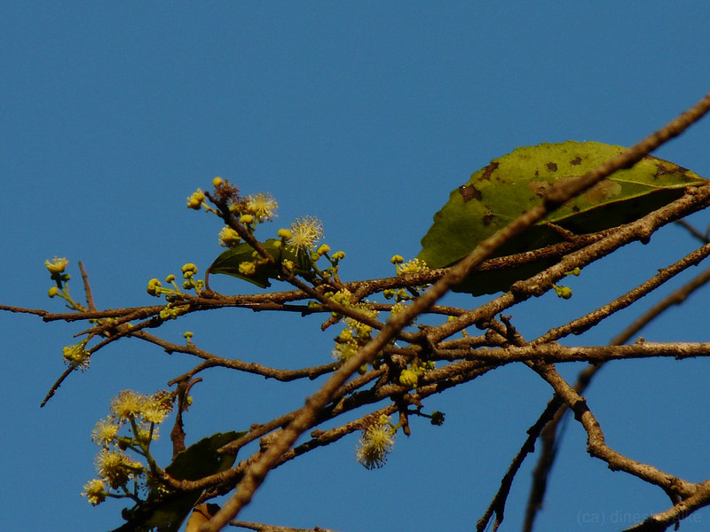

# Flacourtia indica - Indian plum, Mulluthaare

[TOC]

**Flacourtia indica** is a smll tree or large shrub. Upto 3-5m tall.
## Uses

## Parts Used
Leaves, Infusion of the Bark.

## Chemical Composition

## Common names
| Language | Names |
| --- | --- |
| English | Indian plum, Flacourtia |
| Kannada | Mulluthaare |

## Properties
Reference: Dravya - Substance, Rasa - Taste, Guna - Qualities, Veerya - Potency, Vipaka - Post-digesion effect, Karma - Pharmacological activity, Prabhava - Therepeutics.
### Dravya
### Rasa
### Guna
### Veerya
### Vipaka
### Karma
### Prabhava
## Habit
## Identification
### Leaf

### Flower
### Fruit
### Other features
## List of Ayurvedic medicine in which the herb is used
## Where to get the saplings
## Mode of Propagation
## How to plant/cultivate

## Commonly seen growing in areas

## Photo Gallery

## References

## External Links
* [ ]
* [ ]
* [ ]

## References

1. [Chemistry]
2. [Morphology]
3. [Cultivation]
4. **Dinesh Valke. Photograph of *Flacourtia indica*. Flickr, CC BY 2.0.** [Source](https://www.flickr.com/photos/dinesh_valke/3089374492)
