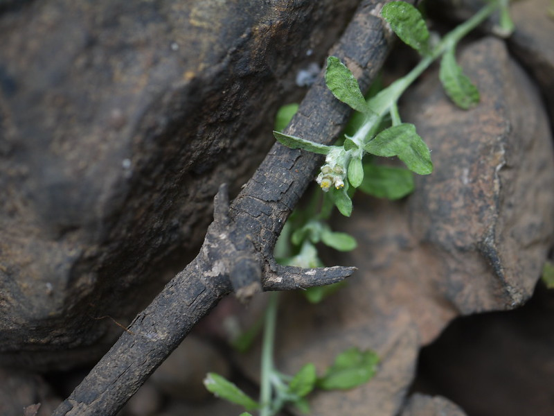

# Gnaphalium polycaulon - Many stemmed Cudweed, Saamba gida

[TOC]

**Gnaphalium polycaulon** is an erect to prostate annual herb. It can grow upto 30cm tall. Branched from the base. White wolly velvety.
## Uses
Colds, Flu, Pnemonea, Tonsillitis, Flu.

## Parts Used

## Chemical Composition

## Common names
| Language | Names |
| --- | --- |
| English | Many stemmed Cudweed |
| Kannada | Saamba gida |

## Properties
Reference: Dravya - Substance, Rasa - Taste, Guna - Qualities, Veerya - Potency, Vipaka - Post-digesion effect, Karma - Pharmacological activity, Prabhava - Therepeutics.
### Dravya
### Rasa
### Guna
### Veerya
### Vipaka
### Karma
### Prabhava
## Habit
## Identification
### Leaf
Linear, Obovate to invetred lanceshaped, Spoon shaped

### Flower
3mm across, Bell shaped in terminal or axillary dense leafy spikes, Phyllaries are 2-3 seriate

### Fruit
### Other features
## List of Ayurvedic medicine in which the herb is used
## Where to get the saplings
## Mode of Propagation
## How to plant/cultivate

## Commonly seen growing in areas

## Photo Gallery

## References

## External Links
* [ ]
* [ ]
* [ ]

## References

1. [Chemistry]
2. Kappatagudda - A Repertoire of  Medicianal Plants of Gadag by Yashpal Kshirasagar and Sonal Vrishni, Page No. 202
3. [Cultivation]
4. **Dinesh Valke. Photograph of *Gnaphalium polycaulon*. Flickr, CC BY 2.0.** [Source](https://www.flickr.com/photos/dinesh_valke/8460744537)
