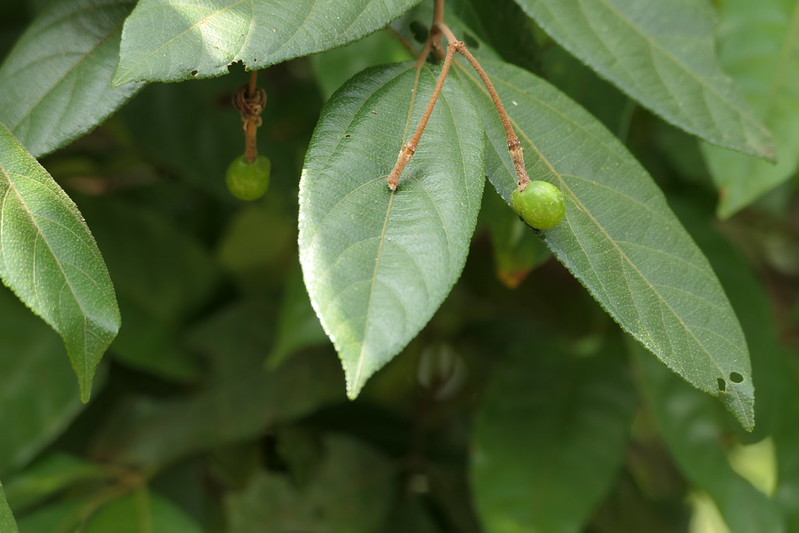

# Grewia heterotricha - Petriyaachu, Kaadujane

[TOC]

**Grewia heterotricha** is a small tree or shrub.

## Uses

## Parts Used

## Chemical Composition

## Common names
| Language | Names |
| --- | --- |
| English | Petriyaachu |
| Kannada | Kaadujane |

## Properties
Reference: Dravya - Substance, Rasa - Taste, Guna - Qualities, Veerya - Potency, Vipaka - Post-digesion effect, Karma - Pharmacological activity, Prabhava - Therepeutics.
### Dravya
### Rasa
### Guna
### Veerya
### Vipaka
### Karma
### Prabhava
## Habit
## Identification
### Leaf
Oblong - Lanceolate, Round, 5x10 to 1.5 to 2.5cm

### Flower
Polygamous in axillary, 5-6mm long, White, 16-20, Oblong-lanceolate and It contains white petals

### Fruit
Drupes

### Other features
## List of Ayurvedic medicine in which the herb is used
## Where to get the saplings
## Mode of Propagation
## How to plant/cultivate

## Commonly seen growing in areas

## Photo Gallery

## References

## External Links
* [ ]
* [ ]
* [ ]

## References

1. [Chemistry]
2. Kappatagudda - A Repertoire of  Medicianal Plants of Gadag by Yashpal Kshirasagar and Sonal Vrishni, Page No. 208
3. [Cultivation]
4. **Dinesh Valke. Photograph of *Grewia heterotricha*. Flickr, CC BY 2.0.** [Source](https://www.flickr.com/photos/dinesh_valke/53527137788)
