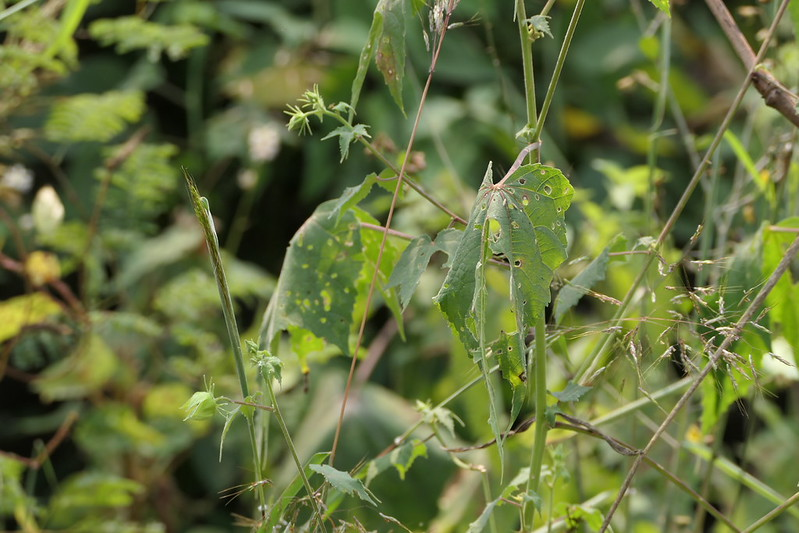

## Uses

## Parts Used
stem, leaves, Root.

## Chemical Composition

## Common names
| Language | Names |
| --- | --- |
| Sanskrit | Vanakarpasa |
| English | Five-winged capsule rose-mallow, Grape leaved mallow |
| Gujarati | Jangli bhindo |
| Hindi | Ban okra |
| Kannada | ಮಣಿ ತುತ್ತೀ ಗಿಡ Mani thutthi gida, ಪಿಂಡೀ ಸೊಪ್ಪು Pindi soppu |
| Malayalam | Kaattu vellooram |
| Marathi | Vankapas |
| Tamil | Ciru-tutti |
| Telugu | Adavi patthi |

## Properties
Reference: Dravya - Substance, Rasa - Taste, Guna - Qualities, Veerya - Potency, Vipaka - Post-digesion effect, Karma - Pharmacological activity, Prabhava - Therepeutics.
### Dravya
### Rasa
### Guna
### Veerya
### Vipaka
### Karma
### Prabhava
## Habit
## Identification
### Leaf

### Flower
### Fruit
### Other features
## List of Ayurvedic medicine in which the herb is used
## Where to get the saplings
## Mode of Propagation
## How to plant/cultivate

## Commonly seen growing in areas

## Photo Gallery

## References

## External Links
* [ ]
* [ ]
* [ ]

## References

1. ["Chemistry"]
2. ["Morphology"]
3. [ "Cultivation"]
4. Indian Medicinal Plants by C.P.Khare
5. **Dinesh Valke. Photograph of *Hibiscus vitifolius*. Flickr, CC BY 2.0.** [Source](https://www.flickr.com/photos/dinesh_valke/53308964536)
