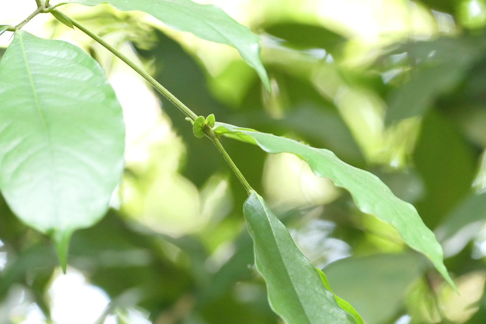

## Uses
Leucorrhoea, Discharges.

## Parts Used
stem, leaves, Root.

## Chemical Composition

## Common names
| Language | Names |
| --- | --- |
| English | Brown's humboldtia |
| Kannada | ಹಾಸಿಗೆ ಮರ Hasige mara, ಕಾಡು ಅಶೋಕ Kadu ashoka |
| Malayalam | Kattasokam |

## Properties
Reference: Dravya - Substance, Rasa - Taste, Guna - Qualities, Veerya - Potency, Vipaka - Post-digesion effect, Karma - Pharmacological activity, Prabhava - Therepeutics.
### Dravya
### Rasa
### Guna
### Veerya
### Vipaka
### Karma
### Prabhava
## Habit
## Identification
### Leaf

### Flower
### Fruit
### Other features
## List of Ayurvedic medicine in which the herb is used
## Where to get the saplings
## Mode of Propagation
## How to plant/cultivate

## Commonly seen growing in areas

## Photo Gallery

## References

## External Links
* [ ]
* [ ]
* [ ]

## References

1. ["Chemistry"]
2. ["Morphology"]
3. [names](Common)(https://sites.google.com/site/indiannamesofplants/via-species/h/humboldtia-brunonis)
4. [ "Cultivation"]
5. Indian Medicinal Plants by C.P.Khare
6. **Daitota, P. S. Venkatarama. *Auṣadhīya Sasyagaḷu (ಔಷಧೀಯ ಸಸ್ಯಗಳು; Medicinal Plants)*. Vivekananda Samshodhana Kendra, Vivekananda Vidyavardhaka Sangha, Puttur, 2016, pp. 217-218.**
   Medicinal uses as mentioned in Daitota's Auṣadhīya Sasyagaḷu: presented as a remedy for chronic leucorrhoea / discharges (dīrgha-kālīna pradara). The author calls it the 'Asoka of the Sahyadri'. Bark, leaf, flower are used. Chronic leucorrhoea: 25 g of Ciṭṭuga bark in 3 cups water reduced to ¼ cup decoction — taken once daily; combined with 4–6 day external lepa from leaves and shoots.
7. **Dinesh Valke. Photograph of *Humboldtia brunonis*. Flickr, CC BY 2.0.** [Source](https://www.flickr.com/photos/dinesh_valke/53529198415)
