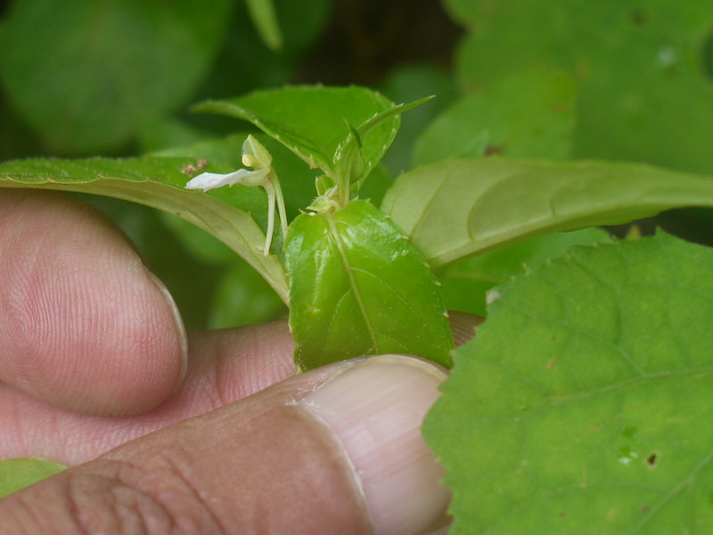

## Uses
Uterine complaints.

## Parts Used
stem, leaves, Root.

## Chemical Composition

## Common names
| Language | Names |
| --- | --- |
| Sanskrit | Shravani |
| English | Lesser balsam |
| Kannada | ಸೋನೆ ಹೂ Sone hoo |
| Malayalam | Mashithandu |
| Marathi | Lahan terda |

## Properties
Reference: Dravya - Substance, Rasa - Taste, Guna - Qualities, Veerya - Potency, Vipaka - Post-digesion effect, Karma - Pharmacological activity, Prabhava - Therepeutics.
### Dravya
### Rasa
### Guna
### Veerya
### Vipaka
### Karma
### Prabhava
## Habit
## Identification
### Leaf

### Flower
### Fruit
### Other features
## List of Ayurvedic medicine in which the herb is used
## Where to get the saplings
## Mode of Propagation
## How to plant/cultivate

## Commonly seen growing in areas

## Photo Gallery

## References

## External Links
* [ ]
* [ ]
* [ ]

## References

1. ["Chemistry"]
2. ["Morphology"]
3. [names](Common)(https://sites.google.com/site/indiannamesofplants/via-species/i/impatiens-minor)
4. [ "Cultivation"]
5. Indian Medicinal Plants by C.P.Khare
6. **Daitota, P. S. Venkatarama. *Auṣadhīya Sasyagaḷu (ಔಷಧೀಯ ಸಸ್ಯಗಳು; Medicinal Plants)*. Vivekananda Samshodhana Kendra, Vivekananda Vidyavardhaka Sangha, Puttur, 2016, p. 426.**
   Medicinal uses as mentioned in Daitota's Auṣadhīya Sasyagaḷu: presented as a reliever of uterine complaints (garbhāśayada tondaregaḷa nivāraka). Flower and whole plant used. Uterine complaints: 3 fresh Sōṇe hū flowers ground with 1 spoon rose-water, externally applied; daily 1 month.
7. **Dinesh Valke. Photograph of *Impatiens minor*. Flickr, CC BY 2.0.** [Source](https://www.flickr.com/photos/dinesh_valke/4780120502)
