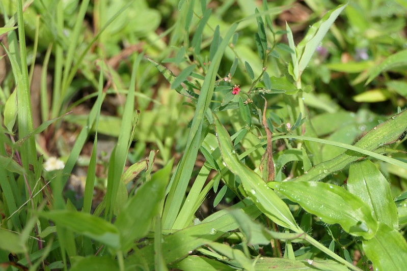

# Indigofera linifolia - Narrowleaf indigo, ಗಂಜಿಕಸ, Bhangra, Barbada

[TOC]

**Indigofera linifolia** is a slender, Much branched, Prostrate or erect annual, growing up to 50cm in height.
## Uses
Nervous disorders, Asthama, Bronchitis.

## Parts Used
stem, leaves, Root.

## Chemical Composition

## Common names
| Language | Names |
| --- | --- |
| English | Narrowleaf indigo |
| Gujarati | Jhinaki gali, Nani gali |
| Hindi | Bhangra, Bhurbhura |
| Kannada | ಗಂಜಿಕಸ Ganjikasa |
| Marathi | Barbada, Lal godhadi |
| Punjabi | Torki |

## Properties
Reference: Dravya - Substance, Rasa - Taste, Guna - Qualities, Veerya - Potency, Vipaka - Post-digesion effect, Karma - Pharmacological activity, Prabhava - Therepeutics.
### Dravya
### Rasa
### Guna
### Veerya
### Vipaka
### Karma
### Prabhava
## Habit
## Identification
### Leaf
Nearly stalkless, Narrow, Linear to oblong lanceolate

### Flower
3-8mm long, Bright red, Flowering season is December to March

### Fruit
Globular, Brown-Black, Smooth, Fruiting season is December to March

### Other features
## List of Ayurvedic medicine in which the herb is used
## Where to get the saplings
## Mode of Propagation
## How to plant/cultivate

## Commonly seen growing in areas

## Photo Gallery

## References

## External Links
* [ ]
* [ ]
* [ ]

## References

1. [Chemistry]
2. Kappatagudda - A Repertoire of  Medicianal Plants of Gadag by Yashpal Kshirasagar and Sonal Vrishni, Page No. 233
3. [Cultivation]
4. Indian Medicinal Plants by C.P.Khare
5. **Dinesh Valke. Photograph of *Indigofera linifolia*. Flickr, CC BY 2.0.** [Source](https://www.flickr.com/photos/dinesh_valke/51415709472)
