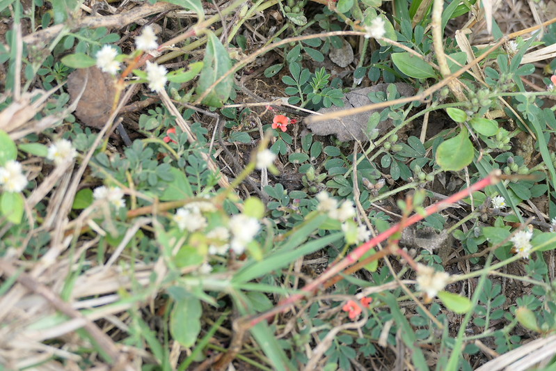

# Indigofera linnaei - Birdsville indigo, ಚೆನ್ನೆ ಗಿಡ, Pandarphali, Ceruppu-nerunci, Chalapachi, Cempullati, Bhingule

[TOC]

**Indigofera linnaei** is prostrate, Much branched herb.
## Uses
Old veneral affections.

## Parts Used
Seeds.

## Chemical Composition

## Common names
| Language | Names |
| --- | --- |
| English | Birdsville indigo, Nine-leaved indigo |
| Gujarati | Bhonyagali |
| Hindi | Pandarphali |
| Kannada | ಚೆನ್ನೆ ಗಿಡ Chenna gida, ಕೆನ್ನೆಗ್ಗಿಲು Kenneggilu |
| Malayalam | Cempullati |
| Marathi | Bhingule, Bhuimuli |
| Tamil | Ceruppu-nerunci, Cilapeci |
| Telugu | Chalapachi, Cherragaddamu |

## Properties
Reference: Dravya - Substance, Rasa - Taste, Guna - Qualities, Veerya - Potency, Vipaka - Post-digesion effect, Karma - Pharmacological activity, Prabhava - Therepeutics.
### Dravya
### Rasa
### Guna
### Veerya
### Vipaka
### Karma
### Prabhava
## Habit
## Identification
### Leaf
Compound, Compound with 5-9 alternately arranged leaflets

### Flower
Spike, 2cm long, Bright red, Standard petal 4mm length, Flowering season is October to November

### Fruit
Velvety, 3-6mm, 1-3 seeded, Fruiting season is October to November

### Other features
## List of Ayurvedic medicine in which the herb is used
## Where to get the saplings
## Mode of Propagation
## How to plant/cultivate

## Commonly seen growing in areas

## Photo Gallery

## References

## External Links
* [ ]
* [ ]
* [ ]

## References

1. [Chemistry]
2. Kappatagudda - A Repertoire of  Medicianal Plants of Gadag by Yashpal Kshirasagar and Sonal Vrishni, Page No. 234
3. [Cultivation]
4. Indian Medicinal Plants by C.P.Khare
5. **Dinesh Valke. Photograph of *Indigofera linnaei*. Flickr, CC BY 2.0.** [Source](https://www.flickr.com/photos/dinesh_valke/53518466738)
