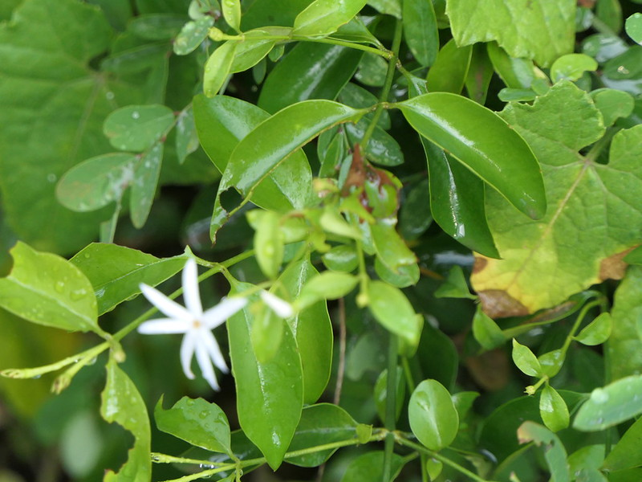

# Jasminum angustifolium

[TOC]

**Jasminum angustifolium** is a wiry, climbing shrub, Young branches covered with minute, soft hairs.
## Uses
Ringworm, Conjuctivitis, Mouth ulcers.

## Parts Used

## Chemical Composition

## Common names
## Properties
Reference: Dravya - Substance, Rasa - Taste, Guna - Qualities, Veerya - Potency, Vipaka - Post-digesion effect, Karma - Pharmacological activity, Prabhava - Therepeutics.
### Dravya
### Rasa
### Guna
### Veerya
### Vipaka
### Karma
### Prabhava
## Habit
## Identification
### Leaf
3-5cm, Ovate, Acute, Glabrous

### Flower
Solitary, Corolla white, Purplish on on outside in bud, Fragrant. Flowering season is June-August

### Fruit
Fruiting season is June-August

### Other features
## List of Ayurvedic medicine in which the herb is used
## Where to get the saplings
## Mode of Propagation
## How to plant/cultivate

## Commonly seen growing in areas

## Photo Gallery

## References

## External Links
* [ ]
* [ ]
* [ ]

## References

1. [Chemistry]
2. Kappatagudda - A Repertoire of  Medicianal Plants of Gadag by Yashpal Kshirasagar and Sonal Vrishni, Page No. 241
3. [Cultivation]
4. Indian Medicinal Plants by C.P.Khare
5. **Dinesh Valke. Photograph of *Jasminum angustifolium*. Flickr, CC BY 2.0.** [Source](https://www.flickr.com/photos/dinesh_valke/48922929842)
