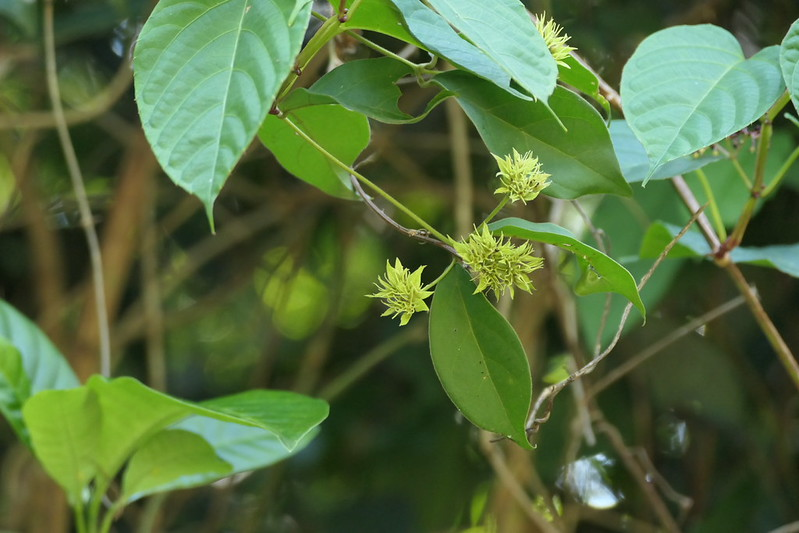

## Uses
Skin eruptions.

## Parts Used
stem, leaves, Root.

## Chemical Composition

## Common names
| Language | Names |
| --- | --- |
| English | White-bracted jasmine |
| Kannada | ವನಮಲ್ಲಿಗೆ Vanamallige |
| Malayalam | Kattumulla |
| Marathi | Vikhamogari |
| Tamil | Erumai-mullai |

## Properties
Reference: Dravya - Substance, Rasa - Taste, Guna - Qualities, Veerya - Potency, Vipaka - Post-digesion effect, Karma - Pharmacological activity, Prabhava - Therepeutics.
### Dravya
### Rasa
### Guna
### Veerya
### Vipaka
### Karma
### Prabhava
## Habit
## Identification
### Leaf

### Flower
### Fruit
### Other features
## List of Ayurvedic medicine in which the herb is used
## Where to get the saplings
## Mode of Propagation
## How to plant/cultivate

## Commonly seen growing in areas

## Photo Gallery

## References

## External Links
* [ ]
* [ ]
* [ ]

## References

1. [Chemistry]
2. [Morphology]
3. [names](Common)(https://sites.google.com/site/indiannamesofplants/via-species/j/jasminum-coarctatum-var-coarctatum)
4. [Cultivation]
5. Indian Medicinal Plants by C.P.Khare
6. **Daitota, P. S. Venkatarama. *Auṣadhīya Sasyagaḷu (ಔಷಧೀಯ ಸಸ್ಯಗಳು; Medicinal Plants)*. Vivekananda Samshodhana Kendra, Vivekananda Vidyavardhaka Sangha, Puttur, 2016, pp. 183-184.**
   Medicinal uses as mentioned in Daitota's Auṣadhīya Sasyagaḷu: presented as a remedy for skin eruptions (carma ākramaṇagaḷige). Root, leaf, shoot, fruit and flower are used. Common skin diseases: leaves ground with water and applied as external lepa for 3–6 days.
7. **Dinesh Valke. Photograph of *Jasminum coarctatum*. Flickr, CC BY 2.0.** [Source](https://www.flickr.com/photos/dinesh_valke/54550080647)
