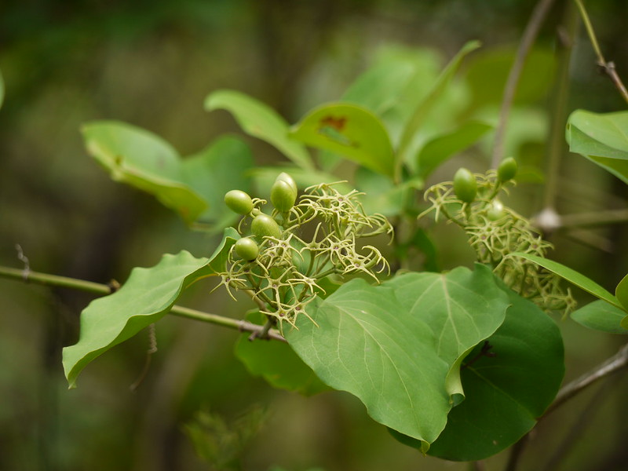

## Uses

### Food
Jasminum malabaricum can be used in Food. Mature fruits are eaten raw or cooked as vegetable. The fruits are popularly known as Ghugarya. A special dish called usal is prepared by frying and cooking the fruits.

## Parts Used
stem, leaves, Root.

## Chemical Composition

## Common names
## Properties
Reference: Dravya - Substance, Rasa - Taste, Guna - Qualities, Veerya - Potency, Vipaka - Post-digesion effect, Karma - Pharmacological activity, Prabhava - Therepeutics.
### Dravya
### Rasa
### Guna
### Veerya
### Vipaka
### Karma
### Prabhava
### Nutritional components
Jasminum malabaricum Contains the Following nutritional components like - Tannin; calcium, phosphorus

## Habit
## Identification
### Leaf

### Flower
### Fruit
### Other features
## List of Ayurvedic medicine in which the herb is used
## Where to get the saplings
## Mode of Propagation
## How to plant/cultivate
Jasminum malabaricum is available through March to June

## Commonly seen growing in areas

## Photo Gallery

## References

## External Links
* [ ]
* [ ]
* [ ]

## References

1. [Chemistry]
2. [Morphology]
3. [Cultivation]
4. Indian Medicinal Plants by C.P.Khare
5. "Forest food for Northern region of Western Ghats" by Dr. Mandar N. Datar and Dr. Anuradha S. Upadhye, Page No.91, Published by Maharashtra Association for the Cultivation of Science (MACS) Agharkar Research Institute, Gopal Ganesh Agarkar Road, Pune
6. **Dinesh Valke. Photograph of *Jasminum malabaricum*. Flickr, CC BY 2.0.** [Source](https://www.flickr.com/photos/dinesh_valke/4695543676)
