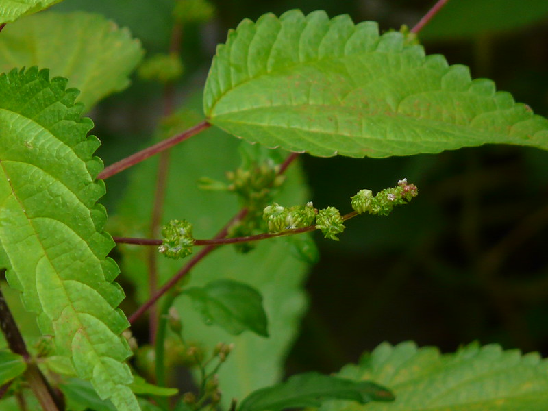

## Uses
Blood disorders.

## Parts Used
stem, leaves, Root.

## Chemical Composition

## Common names
| Language | Names |
| --- | --- |
| Sanskrit | Vrushrchat |
| English | Hawai'i woodnettle, Hen's nettle |
| Hindi | Bichata |
| Kannada | ಕಾಡು ಚುರುಚುರಕನ ಗಿಡ Kaadu churuchurukana gida, ಪಂಚರಂಗಿ Pancharangi |
| Malayalam | Anakkotittuva |
| Marathi | Aagya |
| Tamil | Peru-n-kanchori |

## Properties
Reference: Dravya - Substance, Rasa - Taste, Guna - Qualities, Veerya - Potency, Vipaka - Post-digesion effect, Karma - Pharmacological activity, Prabhava - Therepeutics.
### Dravya
### Rasa
### Guna
### Veerya
### Vipaka
### Karma
### Prabhava
## Habit
## Identification
### Leaf

### Flower
### Fruit
### Other features
## List of Ayurvedic medicine in which the herb is used
## Where to get the saplings
## Mode of Propagation
## How to plant/cultivate

## Commonly seen growing in areas

## Photo Gallery

## References

## External Links
* [ ]
* [ ]
* [ ]

## References

1. [Chemistry]
2. [Morphology]
3. [names](Common)(https://sites.google.com/site/indiannamesofplants/via-species/l/laportea-interrupta)
4. [Cultivation]
5. Indian Medicinal Plants by C.P.Khare
6. **Daitota, P. S. Venkatarama. *Auṣadhīya Sasyagaḷu (ಔಷಧೀಯ ಸಸ್ಯಗಳು; Medicinal Plants)*. Vivekananda Samshodhana Kendra, Vivekananda Vidyavardhaka Sangha, Puttur, 2016, pp. 194-195.**
   Medicinal uses as mentioned in Daitota's Auṣadhīya Sasyagaḷu: presented as a remedy for rakta-doṣa / blood ailments. Root, leaf and joint of the plant are used. Mouth ulcer / mouth bleeding: 1 ciḍi Gaṇḍu kuruci root, jaggery, in 1 cup water, boiled to ½ cup decoction; taken once daily for 2–3 days.
7. **Dinesh Valke. Photograph of *Laportea interrupta*. Flickr, CC BY 2.0.** [Source](https://www.flickr.com/photos/dinesh_valke/2788875359)
