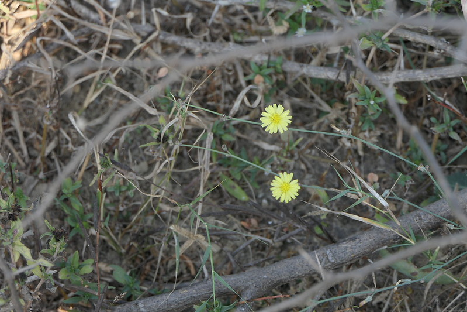

# Launaea procumbens - Creeping Launaea, Kemputorai

[TOC]

**Launaea procumbens** is glabrous herb.
## Uses
Fever, Cancer, Inflammation, Rheumatism, Boils, Swellings, Kidney disorder, Painful urination, Gonorrhea, Sexual diseases.

## Parts Used
Leaves.

## Chemical Composition

## Common names
| Language | Names |
| --- | --- |
| English | Creeping Launaea |
| Kannada | Kemputorai |

## Properties
Reference: Dravya - Substance, Rasa - Taste, Guna - Qualities, Veerya - Potency, Vipaka - Post-digesion effect, Karma - Pharmacological activity, Prabhava - Therepeutics.
### Dravya
### Rasa
### Guna
### Veerya
### Vipaka
### Karma
### Prabhava
## Habit
## Identification
### Leaf
Radical, Entire or Pinnatifid

### Flower
Yellow, Solitary

### Fruit
Achenes, Truncate at both ends, Strongly 4 ribbed

### Other features
## List of Ayurvedic medicine in which the herb is used
## Where to get the saplings
## Mode of Propagation
## How to plant/cultivate

## Commonly seen growing in areas

## Photo Gallery

## References

## External Links
* [ ]
* [ ]
* [ ]

## References

1. [Chemistry]
2. Kappatagudda - A Repertoire of  Medicianal Plants of Gadag by Yashpal Kshirasagar and Sonal Vrishni, Page No. 252
3. [Cultivation]
4. **Dinesh Valke. Photograph of *Launaea procumbens*. Flickr, CC BY 2.0.** [Source](https://www.flickr.com/photos/dinesh_valke/52509859381)
