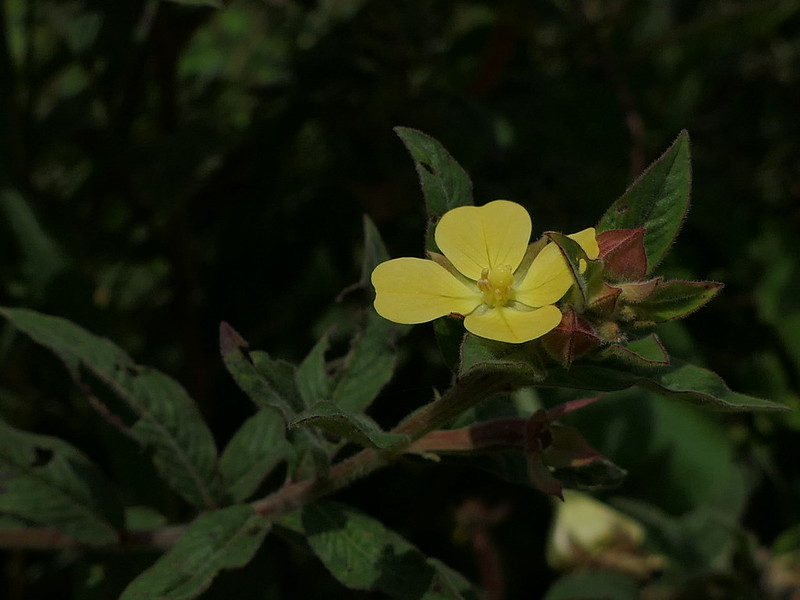

# Ludwigia perennis - Perennial water primrose, Kerebendugida

[TOC]

**Ludwigia perennis** is an annual herb.
## Uses
Fever, Cuts, Bruises.

## Parts Used
Leaves, Plant extract, Plant ash.

## Chemical Composition

## Common names
| Language | Names |
| --- | --- |
| English | Perennial water primrose |
| Kannada | Kerebendugida |

## Properties
Reference: Dravya - Substance, Rasa - Taste, Guna - Qualities, Veerya - Potency, Vipaka - Post-digesion effect, Karma - Pharmacological activity, Prabhava - Therepeutics.
### Dravya
### Rasa
### Guna
### Veerya
### Vipaka
### Karma
### Prabhava
## Habit
## Identification
### Leaf
Elliptic, Lanceolate, Base narrowed, Tip pointed to long pointed

### Flower
Stalkless, Yellow, 4 marous, sepal tube is odnate to ovary

### Fruit
Capsule, 1-2cm long, Linear, Subterete, 4 ribbed, ellipsoid

### Other features
## List of Ayurvedic medicine in which the herb is used
## Where to get the saplings
## Mode of Propagation
## How to plant/cultivate

## Commonly seen growing in areas

## Photo Gallery

## References

## External Links
* [ ]
* [ ]
* [ ]

## References

1. [Chemistry]
2. Kappatagudda - A Repertoire of  Medicianal Plants of Gadag by Yashpal Kshirasagar and Sonal Vrishni, Page No. 263
3. [Cultivation]
4. **Dinesh Valke. Photograph of *Ludwigia perennis*. Flickr, CC BY 2.0.** [Source](https://www.flickr.com/photos/dinesh_valke/49110570306)
