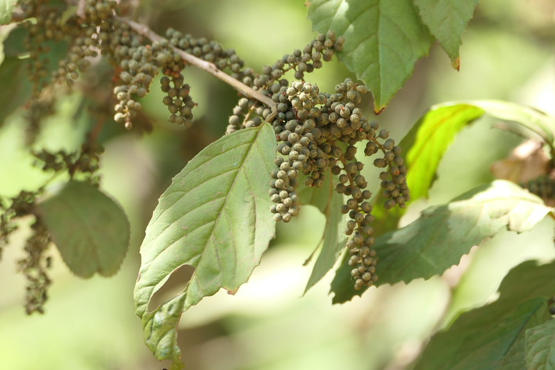

## Uses

### Food
Maesa indica can be used in Food. Leaves are cooked as vegetable. Shoots and fruits are eaten raw.

## Parts Used
Seeds.

## Chemical Composition

## Common names
| Language | Names |
| --- | --- |
| English | Wild berry, Wild tea, Wind berry |
| Hindi | Kramighna phal |
| Kannada | ಗುಡ್ಡೆ ಹರಗಿ Gudde haragi, ಮಂಡಸೆ Mandase |
| Malayalam | Kiriti |
| Marathi | Ataki |
| Tamil | Periya-unni, Kiriti |

## Properties
Reference: Dravya - Substance, Rasa - Taste, Guna - Qualities, Veerya - Potency, Vipaka - Post-digesion effect, Karma - Pharmacological activity, Prabhava - Therepeutics.
### Dravya
### Rasa
### Guna
### Veerya
### Vipaka
### Karma
### Prabhava
### Nutritional components
Maesa indica Contains the Following nutritional components like - Vitamin-C; Calcium, Copper, Iron, Magnesium, Manganese, Phosphorus, Potassium, Sodium, Zinc

## Habit
Shrub, Small tree.

## Identification
### Leaf

### Flower
Flowering from November to April

### Fruit
Fruiting from November to April

### Other features
## List of Ayurvedic medicine in which the herb is used
## Where to get the saplings
## Mode of Propagation
## How to plant/cultivate
Maesa indica is available throughout the year.

## Commonly seen growing in areas
Wild forest, Scrub forest.

## Photo Gallery

## References

## External Links
* [ ]
* [ ]
* [ ]

## References

1. [Chemistry]
2. [Morphology]
3. [names](Common)(https://sites.google.com/site/indiannamesofplants/via-species/m/maesa-indica)
4. [Cultivation]
5. Indian Medicinal Plants by C.P.Khare
6. "Forest food for Northern region of Western Ghats" by Dr. Mandar N. Datar and Dr. Anuradha S. Upadhye, Page No.107, Published by Maharashtra Association for the Cultivation of Science (MACS) Agharkar Research Institute, Gopal Ganesh Agarkar Road, Pune
7. **Dinesh Valke. Photograph of *Maesa indica*. Flickr, CC BY 2.0.** [Source](https://www.flickr.com/photos/dinesh_valke/53705318216)
