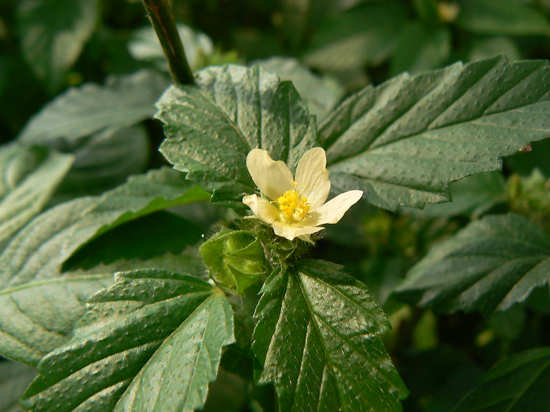

# Malvastrum coromandelianum - Common false mallow, Sannabindige

[TOC]

**Malvastrum coromandelianum** is an upright, subwoody or subshrub plant.
## Uses
Carbuncles, Cough, Lung diseases, Jaundice, Wounds, Desentery.

## Parts Used
Leaves, Flowers.

## Chemical Composition

## Common names
| Language | Names |
| --- | --- |
| English | Common false mallow |
| Kannada | Sannabindige |

## Properties
Reference: Dravya - Substance, Rasa - Taste, Guna - Qualities, Veerya - Potency, Vipaka - Post-digesion effect, Karma - Pharmacological activity, Prabhava - Therepeutics.
### Dravya
### Rasa
### Guna
### Veerya
### Vipaka
### Karma
### Prabhava
## Habit
## Identification
### Leaf
Alternate, Simple, Elongated, Slightly hairy, Associated in pairs and strongly toothed

### Flower
Solitary, In small groups in terminal position at the base of the leaves. Flowering season is June to August

### Fruit
Dry, Flattened, Hairy and disc-shaped, Each fruit has one spine on the top. Fruiting season is June to August

### Other features
## List of Ayurvedic medicine in which the herb is used
## Where to get the saplings
## Mode of Propagation
## How to plant/cultivate

## Commonly seen growing in areas

## Photo Gallery

## References

## External Links
* [ ]
* [ ]
* [ ]

## References

1. [Chemistry]
2. Kappatagudda - A Repertoire of  Medicianal Plants of Gadag by Yashpal Kshirasagar and Sonal Vrishni, Page No. 267
3. [Cultivation]
4. **Dinesh Valke. Photograph of *Malvastrum coromandelianum*. Flickr, CC BY 2.0.** [Source](https://www.flickr.com/photos/dinesh_valke/1461771973)
