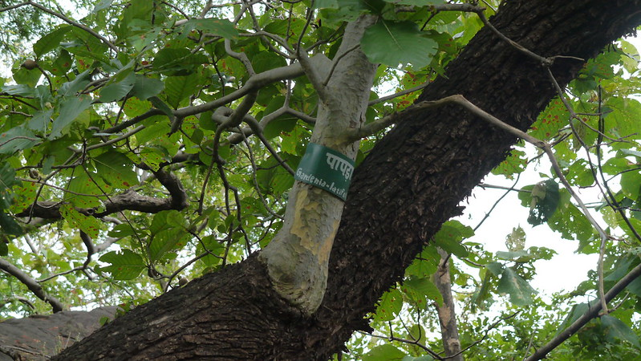

## Uses

### Food
Miliusa tomentosa can be used in Food. Ripe fruits are eaten raw. The fruits have acidic taste.

## Parts Used
stem, leaves, Root.

## Chemical Composition

## Common names
| Language | Names |
| --- | --- |
| English | Tomentose miliusa |
| Gujarati | Umbh |
| Hindi | Hoom, Kari |
| Kannada | ಕರಿ ಹೆಸ್ಸರೆ Kari hessare, ವುಂಬೆ Wumb |
| Malayalam | Kanakkaita |
| Marathi | Humb, Thoska |
| Telugu | Barre duduga |

## Properties
Reference: Dravya - Substance, Rasa - Taste, Guna - Qualities, Veerya - Potency, Vipaka - Post-digesion effect, Karma - Pharmacological activity, Prabhava - Therepeutics.
### Dravya
### Rasa
### Guna
### Veerya
### Vipaka
### Karma
### Prabhava
### Nutritional components
Miliusa tomentosa Contains the Following nutritional components like - Vitamin-A, Thiamine (B1), Riboflavin (B2), Niacin (B3), Pantothenic acid (B5), B6 and C; Calcium, Iron, Magnesium, Manganese, Phosphorus, Potassium, Sodium, Zinc.

## Habit
## Identification
### Leaf

### Flower
### Fruit
### Other features
## List of Ayurvedic medicine in which the herb is used
## Where to get the saplings
## Mode of Propagation
## How to plant/cultivate
Miliusa tomentosa is available through March to June

## Commonly seen growing in areas

## Photo Gallery

## References

## External Links
* [ ]
* [ ]
* [ ]

## References

1. [Chemistry]
2. [Morphology]
3. [names](Common)(https://sites.google.com/site/indiannamesofplants/via-species/m/miliusa-tomentosa)
4. [Cultivation]
5. Indian Medicinal Plants by C.P.Khare
6. "Forest food for Northern region of Western Ghats" by Dr. Mandar N. Datar and Dr. Anuradha S. Upadhye, Page No.113, Published by Maharashtra Association for the Cultivation of Science (MACS) Agharkar Research Institute, Gopal Ganesh Agarkar Road, Pune
7. **Dinesh Valke. Photograph of *Miliusa tomentosa*. Flickr, CC BY 2.0.** [Source](https://www.flickr.com/photos/dinesh_valke/9971320676)
