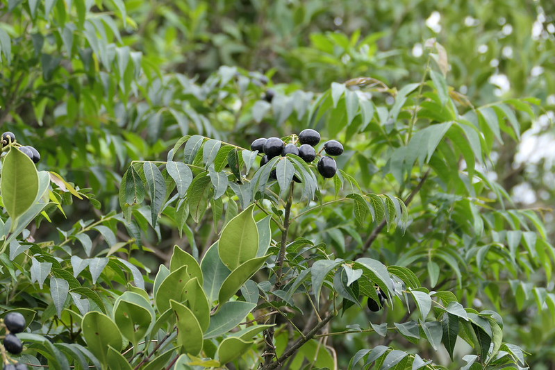

## Uses
Vomit, Snakebite, Venom's bite, Dysentery, Hairfall.

## Parts Used
Bark, Leaf.

## Chemical Composition

## Common names
| Language | Names |
| --- | --- |
| Sanskrit | Kaidairya, Girinimba |
| English | Curry leaves |
| Hindi | Karipatta, Kotneem |
| Kannada | Oggarane soppu, Sambar soppu |
| Tamil | Karivembu, Kariveppile |
| Telugu | Karivepaku |

## Properties
Reference: Dravya - Substance, Rasa - Taste, Guna - Qualities, Veerya - Potency, Vipaka - Post-digesion effect, Karma - Pharmacological activity, Prabhava - Therepeutics.
### Dravya
### Rasa
### Guna
### Veerya
### Vipaka
### Karma
### Prabhava
## Habit
## Identification
### Leaf

### Flower
Flowering from February to April

### Fruit
Fruiting from February to April

### Other features
## List of Ayurvedic medicine in which the herb is used
## Where to get the saplings
## Mode of Propagation
## How to plant/cultivate

## Commonly seen growing in areas

## Photo Gallery

## References

## External Links
* [ ]
* [ ]
* [ ]

## References

1. [Chemistry]
2. [Morphology]
3. [Cultivation]
4. Indian Medicinal Plants by C.P.Khare
5. ”Karnataka Medicinal Plants Volume-3” by Dr.M. R. Gurudeva, Page No.237, Published by Divyachandra Prakashana, #6/7, Kaalika Soudha, Balepete cross, Bengaluru
6. **Dinesh Valke. Photograph of *Murraya koenigi*. Flickr, CC BY 2.0.** [Source](https://www.flickr.com/photos/dinesh_valke/53768588764)
