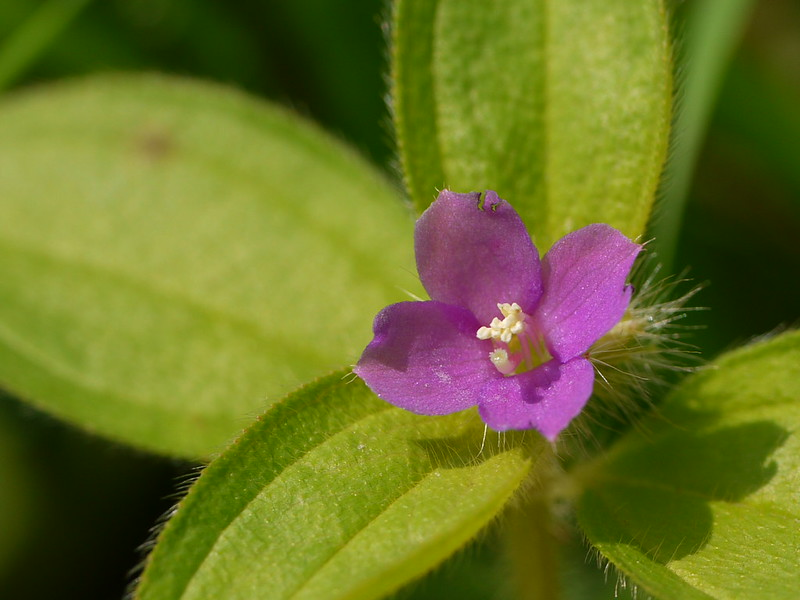

## Uses

## Parts Used
stem, leaves, Root.

## Chemical Composition

## Common names
| Language | Names |
| --- | --- |
| Sanskrit | Tinisah |
| English | Wall osbeckia |
| Kannada | ಅಕ್ಕ ಜೋಗಿ ಗಿಡ Akka jogi gida, ಗಿಡ್ಡ ನೆಕ್ಕರೆ Gidda nekkare |
| Malayalam | Centumpa, Cherukulathi |
| Marathi | Gulbeki |
| Tamil | Cen-tumpai |
| Telugu | Burada alli |

## Properties
Reference: Dravya - Substance, Rasa - Taste, Guna - Qualities, Veerya - Potency, Vipaka - Post-digesion effect, Karma - Pharmacological activity, Prabhava - Therepeutics.
### Dravya
### Rasa
### Guna
### Veerya
### Vipaka
### Karma
### Prabhava
## Habit
## Identification
### Leaf

### Flower
### Fruit
### Other features
## List of Ayurvedic medicine in which the herb is used
## Where to get the saplings
## Mode of Propagation
## How to plant/cultivate

## Commonly seen growing in areas

## Photo Gallery

## References

## External Links
* [ ]
* [ ]
* [ ]

## References

1. ["Chemistry"]
2. ["Morphology"]
3. [names](Common)(https://sites.google.com/site/indiannamesofplants/via-species/o/osbeckia-muralis-naud)
4. [ "Cultivation"]
5. Indian Medicinal Plants by C.P.Khare
6. **Dinesh Valke. Photograph of *Osbeckia muralis Naud*. Flickr, CC BY 2.0.** [Source](https://www.flickr.com/photos/dinesh_valke/5025406058)
