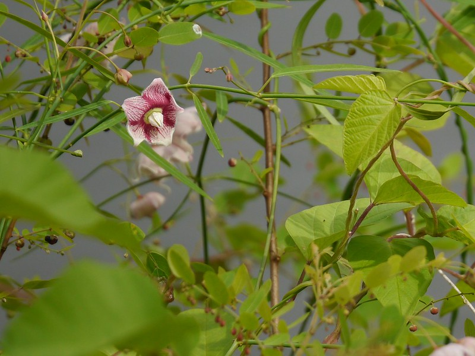

## Uses
Cancer, Menoxenia, Traumatic Injury, Sore throat, Jaundice.

## Parts Used
Roots.

## Chemical Composition

## Common names
| Language | Names |
| --- | --- |
| Sanskrit | Dugdhika |
| English | Needle-leaved swallow-wort, Rosy milkweed vine |
| Gujarati | Jaldodi |
| Hindi | Dudhi |
| Kannada | ದುಗ್ಧಿಕ Dugdhika, ಮೇಕೆ ಕೊಂಬು ಬಳ್ಳಿ Maeke kombu balli |
| Malayalam | Kinikinippala |
| Marathi | Dudhani |
| Punjabi | Gani |
| Tamil | Uci-p-palai |
| Telugu | Pala |

## Properties
Reference: Dravya - Substance, Rasa - Taste, Guna - Qualities, Veerya - Potency, Vipaka - Post-digesion effect, Karma - Pharmacological activity, Prabhava - Therepeutics.
### Dravya
### Rasa
### Guna
### Veerya
### Vipaka
### Karma
### Prabhava
## Habit
## Identification
### Leaf
Oppositely arranged, Linear lancelike with rounded base

### Flower
White-Purple, 5, Occue in raceme-like cymes, drooping

### Fruit
### Other features
## List of Ayurvedic medicine in which the herb is used
## Where to get the saplings
## Mode of Propagation
## How to plant/cultivate

## Commonly seen growing in areas

## Photo Gallery

## References

## External Links
* [ ]
* [ ]
* [ ]

## References

1. [Chemistry]
2. Kappatagudda - A Repertoire of  Medicianal Plants of Gadag by Yashpal Kshirasagar and Sonal Vrishni, Page No. 292
3. [names](Common)(https://sites.google.com/site/indiannamesofplants/via-species/o/oxystelma-esculentum)
4. [Cultivation]
5. Indian Medicinal Plants by C.P.Khare
6. **Dinesh Valke. Photograph of *Oxystelma esculentum*. Flickr, CC BY 2.0.** [Source](https://www.flickr.com/photos/dinesh_valke/48732205646)
