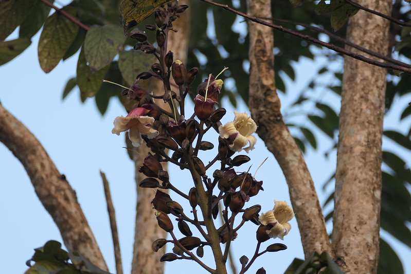

# Pajanelia longifolia - Pajanelia, ಅಲಂಗಿ, Palai-y-utaicci, Alanta, Daundi

[TOC]

**Pajanelia** is an evergreen or briefly deciduous, small to medium-sized, sparingly branched tree with large, ornamental flowers tree. It grows up to 30 metres tall with occasional specimens to 36 metres. The bole is unbuttressed and up to 115 cm in diameter. The tree is sometimes cultivated to provide support for other crops and is also gathered from the wild for medicine and timber. It is occasionally cultivated as medicinal plant in Malaysia.
## Uses
Fever, Stomach disorders.

## Parts Used
stem, leaves, Root.

## Chemical Composition

## Common names
| Language | Names |
| --- | --- |
| English | Pajanelia, Tender wild jack |
| Kannada | ಅಲಂಗಿ Alangi, ದೌಂಡಿ Daundi |
| Malayalam | Alanta |
| Marathi | Daundi |
| Tamil | Palai-y-utaicci |

## Properties
Reference: Dravya - Substance, Rasa - Taste, Guna - Qualities, Veerya - Potency, Vipaka - Post-digesion effect, Karma - Pharmacological activity, Prabhava - Therepeutics.
### Dravya
### Rasa
### Guna
### Veerya
### Vipaka
### Karma
### Prabhava
## Habit
Evergreen tree

## Identification
### Leaf

### Flower
### Fruit
### Other features
## List of Ayurvedic medicine in which the herb is used
## Where to get the saplings
## Mode of Propagation
Seeds

## How to plant/cultivate
A plant of the moist, lowland tropics where it is found at elevations from sea level to 700 metres.

## Commonly seen growing in areas
Hill forest, Lowland forest, Secondary forest, Coastal forest.

## Photo Gallery

## References

## External Links
* [Pajanelia longifoliaon flowers of india.net](https://www.flowersofindia.net/catalog/slides/Pajanelia.html)
* [Pajanelia longifolia on Indiabiodiversity.org](https://indiabiodiversity.org/species/show/16764)

## References

1. [Chemistry]
2. [Morphology]
3. [names](Common)(https://sites.google.com/site/indiannamesofplants/via-species/p/pajanelia-longifolia)
4. [Cultivation](http://tropical.theferns.info/viewtropical.php?id=Pajanelia+longifolia)
5. Indian Medicinal Plants by C.P.Khare
6. **Dinesh Valke. Photograph of *Pajanelia longifolia*. Flickr, CC BY 2.0.** [Source](https://www.flickr.com/photos/dinesh_valke/53573252016)
