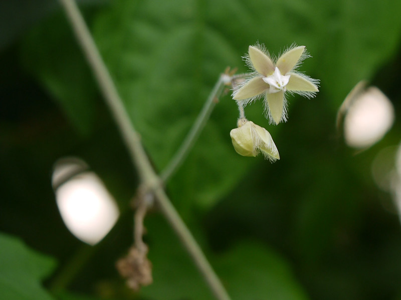

# Pergularia daemia - Hair knot plant, ಬೇಲಿ ಹತ್ತಿ, Dholi dudhi, Veliparutthi, Chebira, Velipparuthi, Menda dudhi

[TOC]

**Pergularia daemia** is a slender, bad smelling, Milky climber, Covered with stiff hairs.
## Uses
Diarrhoea, Colic, Rheumatism, Painful joint cramps in the legs, Malaria, Appendicitis, Amenorrhoea, Boils, Abscesses, Subcutaneous worm infections, Eczema.

## Parts Used
Leaves, Decotion of roots.

## Chemical Composition

## Common names
| Language | Names |
| --- | --- |
| Sanskrit | Chandaldugdhika |
| English | Hair knot plant, Stinking swallowwort |
| Gujarati | Chamar dudheli |
| Hindi | Dholi dudhi |
| Kannada | ಬೇಲಿ ಹತ್ತಿ Beli hatthi, ಹಾಲು ಕೊರಟಿಗೆ Haalu |
| Malayalam | Velipparuthi |
| Marathi | Menda dudhi |
| Tamil | Veliparutthi |
| Telugu | Chebira |

## Properties
Reference: Dravya - Substance, Rasa - Taste, Guna - Qualities, Veerya - Potency, Vipaka - Post-digesion effect, Karma - Pharmacological activity, Prabhava - Therepeutics.
### Dravya
### Rasa
### Guna
### Veerya
### Vipaka
### Karma
### Prabhava
## Habit
## Identification
### Leaf
Broadly ovate, Cordate, Acuminate, Covered with valvety hairs

### Flower
Greenish, In axillary corymb like or racemose like cymes

### Fruit
Follicle with soft spines all over and a long beak, Densely velvety on both sides

### Other features
## List of Ayurvedic medicine in which the herb is used
## Where to get the saplings
## Mode of Propagation
## How to plant/cultivate

## Commonly seen growing in areas

## Photo Gallery

## References

## External Links
* [ ]
* [ ]
* [ ]

## References

1. [Chemistry]
2. Kappatagudda - A Repertoire of  Medicianal Plants of Gadag by Yashpal Kshirasagar and Sonal Vrishni, Page No. 299
3. [names](Common)(https://sites.google.com/site/indiannamesofplants/via-species/p/pergularia-daemia)
4. [Cultivation]
5. Indian Medicinal Plants by C.P.Khare
6. **Dinesh Valke. Photograph of *Pergularia daemia*. Flickr, CC BY 2.0.** [Source](https://www.flickr.com/photos/dinesh_valke/39164738720)
