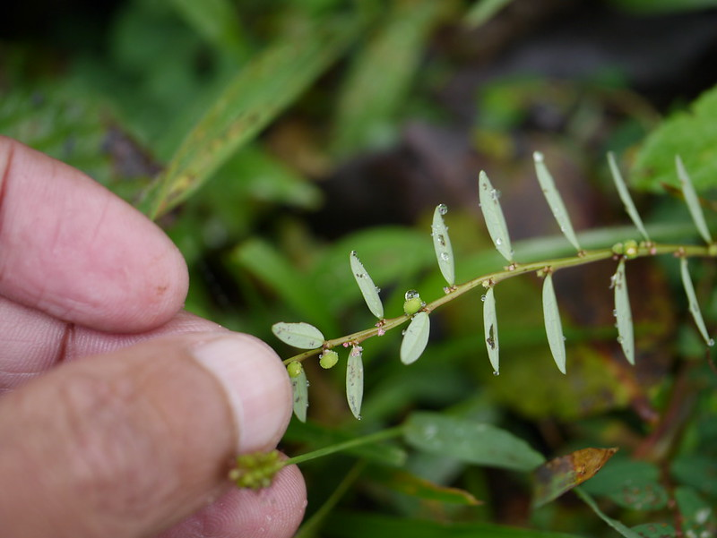

# Phyllanthus virgatus - Virgate leaf flower, Chikka nelli

[TOC]

**Phyllanthus virgatus** is a perennial herb with 15-60cm height with tap root system.
## Uses
Inflammed eyes, Gonorrhea, Intestinal parasites.

## Parts Used

## Chemical Composition

## Common names
| Language | Names |
| --- | --- |
| English | Virgate leaf flower |
| Kannada | Chikka nelli |

## Properties
Reference: Dravya - Substance, Rasa - Taste, Guna - Qualities, Veerya - Potency, Vipaka - Post-digesion effect, Karma - Pharmacological activity, Prabhava - Therepeutics.
### Dravya
### Rasa
### Guna
### Veerya
### Vipaka
### Karma
### Prabhava
## Habit
## Identification
### Leaf
Linear-oblong, Obtuse, Apiculate at apex, rounded and tapering at base.

### Flower
Small, Greenish yellow, Solitary, males few, subsessile, Minutes
### Fruit
Capsules, Globose, Greyish-brown, Obscurely 3 lobed

### Other features
## List of Ayurvedic medicine in which the herb is used
## Where to get the saplings
## Mode of Propagation
## How to plant/cultivate

## Commonly seen growing in areas

## Photo Gallery

## References

## External Links
* [ ]
* [ ]
* [ ]

## References

1. [Chemistry]
2. Kappatagudda - A Repertoire of  Medicianal Plants of Gadag by Yashpal Kshirasagar and Sonal Vrishni, Page No. 303
3. [Cultivation]
4. **Dinesh Valke. Photograph of *Phyllanthus virgatus*. Flickr, CC BY 2.0.** [Source](https://www.flickr.com/photos/dinesh_valke/7985727756)
