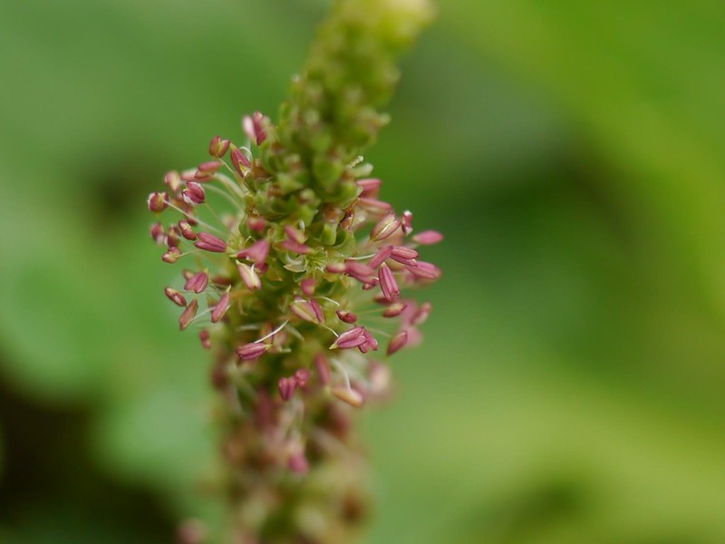

# Plantago major - Indian Mangrove, Ipati, Venkantal, Tella mada, Orayi

[TOC]

**Plantago major** is a species of flowering plant in the plantain family Plantaginaceae. The plant is native to most of Europe and northern and central Asia, but has widely naturalised elsewhere in the world. **Indian mangrove** is an evergreen shrub or tree, usually growing 8 - 18 metres tall but exceptionally to 25 metres.
## Uses
Irritable bowel syndrome, Diarrhea, Constipation,Hemorrhoids.

## Parts Used
Seeds.

## Chemical Composition
Among the flavonoids isolated are baicalein, hispidulin, plantaginin and scutellarein. These have free radical scavenging activity and inhibit lipid peroxidation, and the first 3 are anti-oxidants.

## Common names
| Language | Names |
| --- | --- |
| Sanskrit | Sagarodbhutah |
| English | Indian Mangrove |
| Gujarati | Baklananjhad |
| Kannada | Ipati |
| Malayalam | Orayi |
| Tamil | Venkantal |
| Telugu | Tella mada |

## Properties
Reference: Dravya - Substance, Rasa - Taste, Guna - Qualities, Veerya - Potency, Vipaka - Post-digesion effect, Karma - Pharmacological activity, Prabhava - Therepeutics.
### Dravya
### Rasa
### Guna
### Veerya
### Vipaka
### Karma
### Prabhava
## Habit
Shrub

## Identification
### Leaf

### Flower
### Fruit
### Other features
## List of Ayurvedic medicine in which the herb is used
## Where to get the saplings
## Mode of Propagation
Seeds

## How to plant/cultivate
A plant of the moist to wet tropics and subtropics, where it is always found at around sea-level near the coast.

## Commonly seen growing in areas
Trophical areas.

## Photo Gallery

## References

## External Links
* [Plantego major on www.drugs.com](https://www.drugs.com/npp/plantain.html)

## References

1. [constituents](Chemical)(https://uses.plantnet-project.org/en/Plantago_major_(PROTA))
2. [Morphology]
3. [Cultivation](http://tropical.theferns.info/viewtropical.php?id=Avicennia+officinalis)
4. **Dinesh Valke. Photograph of *Plantago major*. Flickr, CC BY 2.0.** [Source](https://www.flickr.com/photos/dinesh_valke/35240692114)
