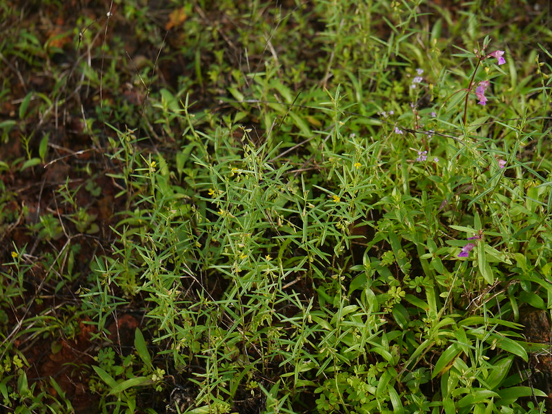

# Polygala elongata - Narroe leaved milkwort, Ghuntaani

[TOC]

**Polygala elongata** is annual herb. It can grow upto 15-20cm tall. Fresh roots are aromatic. Branches are slender and hairless.
## Uses

## Parts Used

## Chemical Composition
It contains a chemical called triterpenoid saponins which has high medical value

## Common names
| Language | Names |
| --- | --- |
| English | Narroe leaved milkwort |
| Kannada | Ghuntaani |

## Properties
Reference: Dravya - Substance, Rasa - Taste, Guna - Qualities, Veerya - Potency, Vipaka - Post-digesion effect, Karma - Pharmacological activity, Prabhava - Therepeutics.
### Dravya
### Rasa
### Guna
### Veerya
### Vipaka
### Karma
### Prabhava
## Habit
## Identification
### Leaf
Alternately arranged, 2-4cm long, Blunt tipped with narrow point at the tip

### Flower
Pea flower, 6-20cm long, Yellow, Arise in racemes

### Fruit
Capsule, Oblong, Unequal sided

### Other features
## List of Ayurvedic medicine in which the herb is used
## Where to get the saplings
## Mode of Propagation
## How to plant/cultivate

## Commonly seen growing in areas

## Photo Gallery

## References

## External Links
* [ ]
* [ ]
* [ ]

## References

1. [Chemistry]
2. Kappatagudda - A Repertoire of  Medicianal Plants of Gadag by Yashpal Kshirasagar and Sonal Vrishni, Page No. 312
3. [Cultivation]
4. **Dinesh Valke. Photograph of *Polygala elongata*. Flickr, CC BY 2.0.** [Source](https://www.flickr.com/photos/dinesh_valke/9528530228)
