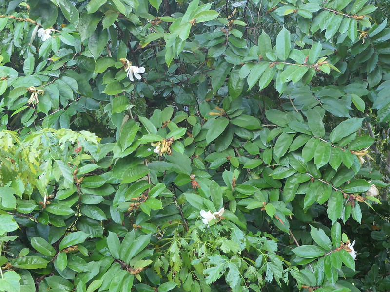

# Pterospermum suberifolium - Bahupatra, Muchukunda gida, Muchkand, Cembolavu, Kumpudi, Cittilaplavu

[TOC]

**Pterospermum suberifolium** is an evergreen, medium-sized tree. The tree is sometimes harvested from the wild for local use as a medicine and source of wood. A pretty tree, it is suitable for use as an ornamental.
## Uses

## Parts Used
stem, leaves, Root.

## Chemical Composition

## Common names
| Language | Names |
| --- | --- |
| Sanskrit | Bahupatra, Kshatravrksha |
| Hindi | Muchkand |
| Kannada | Muchukunda gida |
| Malayalam | Cittilaplavu, Mucukundam |
| Tamil | Cembolavu, Cittilaipolavu |
| Telugu | Kumpudi, Lolagu |

## Properties
Reference: Dravya - Substance, Rasa - Taste, Guna - Qualities, Veerya - Potency, Vipaka - Post-digesion effect, Karma - Pharmacological activity, Prabhava - Therepeutics.
### Dravya
### Rasa
### Guna
### Veerya
### Vipaka
### Karma
### Prabhava
## Habit
Evergreen tree

## Identification
### Leaf

### Flower
### Fruit
### Other features
## List of Ayurvedic medicine in which the herb is used
## Where to get the saplings
## Mode of Propagation
Seeds

## How to plant/cultivate
A rather fast-growing tree.

## Commonly seen growing in areas
Drier regions.

## Photo Gallery

## References

## External Links
* [Pterospermum suberifolium on indiabiodiversity.org](https://indiabiodiversity.org/species/show/224762)
* [Pterospermum suberifolium on sites.google.com](https://sites.google.com/site/efloraofindia/species/m---z/m/malvaceae/pterospermum/pterospermum-canescens)

## References

1. [Chemistry]
2. [Morphology]
3. [names](Local)(https://sites.google.com/site/efloraofindia/species/m---z/m/malvaceae/pterospermum/pterospermum-canescens)
4. [Cultivation]
5. Indian Medicinal Plants by C.P.Khare
6. **Dinesh Valke. Photograph of *Pterospermum suberifolium*. Flickr, CC BY 2.0.** [Source](https://www.flickr.com/photos/dinesh_valke/48927392036)
