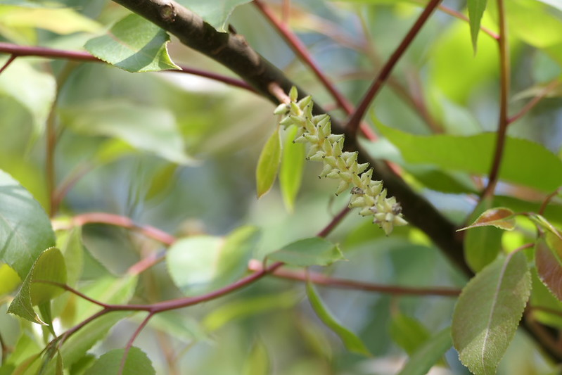

# Salix tetrasperma - Indian Willow, Nirganji, Bod, Atrupalai, Itipal, Arali

[TOC]

**Salix tetraspeama** is a medium sized tree of wet and swampy places, shedding the leaves at the end of monsoon. It flowers after leafing. The bark is rough, with deep, vertical fissures. The young shoots and young leaves are silky.
## Uses
Fever, Whooping cough, Hepatitis, Dysmenorrhea, Rectal sores, Poultice wounds, Epilepsy, Rheumatism, Bladder stones, Hemorrhoids, Diabetes.

## Parts Used
Bark, Leaf, Root.

## Chemical Composition
Phytochemical screenings yield various types of sapogenins: quinovic acid, salicortin, saligenin, phenolic glycosides and pyrocatechol from the bark and leaves.

## Common names
| Language | Names |
| --- | --- |
| Sanskrit | Jalavetasa, Vedula |
| English | Indian Willow |
| Hindi | Bod, Bains |
| Kannada | Nirganji |
| Malayalam | Arali, Atrupala |
| Tamil | Atrupalai |
| Telugu | Itipal |

## Properties
Reference: Dravya - Substance, Rasa - Taste, Guna - Qualities, Veerya - Potency, Vipaka - Post-digesion effect, Karma - Pharmacological activity, Prabhava - Therepeutics.
### Dravya
### Rasa
Tikta (Bitter), Kashaya (Astringent)
### Guna
### Veerya
### Vipaka
### Karma
### Prabhava
## Habit
Tree

## Identification
### Leaf
Paripinnate, Oblong, Leaf Arrangementis Alternate-spiral

### Flower
Unisexual, 2-4cm long, pink, Flowering throughout the year and In terminal and/or axillary pseudoracemes

### Fruit
oblong pod, Thinly septate, pilose, wrinkled, Seeds upto 5, Fruiting throughout the year

### Other features
## List of Ayurvedic medicine in which the herb is used
## Where to get the saplings
## Mode of Propagation
## How to plant/cultivate

## Commonly seen growing in areas
Forest area, Swamp area, Near streams at low and medium altitudes.

## Photo Gallery

## References

## External Links
* [Salix tetraspeama on flowers of india.net](http://www.flowersofindia.net/catalog/slides/Indian%20Willow.html)
* [Salix tetraspeama on herb pathy.com](https://herbpathy.com/Uses-and-Benefits-of-Salix-Tetrasperma-Cid4601)
* [Salix tetraspeama on research gate.net](https://www.researchgate.net/publication/320420770_Ethnobotanical_uses_phytochemistry_and_biological_activities_of_Salix_tetrasperma_roxb_Salicaceae-A_review)

## References

1. [constituents](Chemical)(http://www.stuartxchange.org/Malatiki.html)
2. [Morphology](https://indiabiodiversity.org/species/show/32002)
3. [Cultivation](https://indiabiodiversity.org/species/show/32002)
4. ”Karnataka Medicinal Plants Volume-3” by Dr.M. R. Gurudeva, Page No.665, Published by Divyachandra Prakashana, #6/7, Kaalika Soudha, Balepete cross, Bengaluru
5. **Dinesh Valke. Photograph of *Salix tetrasperma*. Flickr, CC BY-SA 4.0.** [Source](https://www.flickr.com/photos/dinesh_valke/55088902864)
