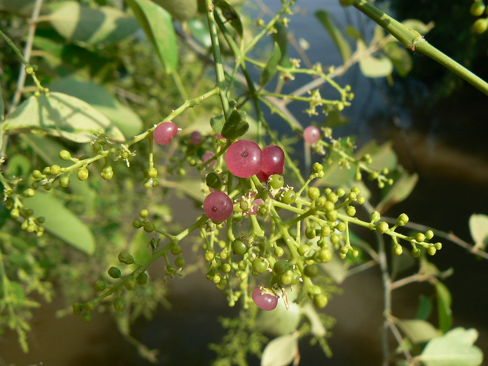

# Salvadora persica - Gudaphal

[TOC]

Salvadora persica (Arak, Galenia asiatica, Meswak, Peelu, Pīlu, Salvadora indica, or toothbrush tree, mustard tree, mustard bush), is a species of Salvadora. Salvadora persica has antiurolithiatic properties. Used for centuries as a natural toothbrush, its fibrous branches have been promoted by the World Health Organization for oral hygiene use. Research suggests that it contains a number of medically beneficial properties including abrasives, antiseptics, astringent, detergents, enzyme inhibitors, and fluoride.

## Description
Salvadora persica is a small tree or shrub with a crooked trunk, seldom more than one foot in diameter. Its bark is scabrous and cracked, whitish with pendulous extremities. The root bark of the tree is similar to sand, and the inner surfaces are an even lighter shade of brown. It has a pleasant fragrance, of cress or mustard, as well as a warm and pungent taste. The leaves break with a fine crisp crackle when trodden on. The tree grows to a maximum height of three meters. In Pakistan these ancient, majestic and sturdy trees are more closely associated with graveyards like the cypress tree in English culture.

## Uses
* Salvadora persica is a popular teeth cleaning stick throughout the Arabian Peninsula, as well as the wider Muslim world.
* The fresh leaves can be eaten as part of a salad and are used in traditional medicine for cough, asthma, scurvy, rheumatism, piles and other diseases.
* The flowers are small and fragrant and are used as a stimulant and are mildly purgative. The berries are small and barely noticeable; they are eaten both fresh and dried.
* In Namibia the mustard bush is used as a drought-resistant fodder plant for cattle. The Topnaar people that still live on the Kuiseb River use it to feed their goats. The plant's seeds can be used to extract a detergent oil

## Common name
* **English** - Toothbrush Tree
* **Kannada** - ಗೊನಿಮರ
* **Hindi** -  Meswak

## References

## External Links
* [Salvadora persica](https://en.wikipedia.org/wiki/Salvadora_persica)

## References

1. [persica"]("Salvadora)(http://www.fao.org/docrep/x5327e/x5327e1j.htm)
2. [Stick: The All Natural Toothbrush"]("Miswak)(http://arthurglosmandds.com/miswak-stick-natural-toothbrush/)
3. Ra'ed I. Al Sadhan, Khalid Almas (1999). "Miswak (chewing Stick): A Cultural And Scientific Heritage.". Saudi Dental Journal. 11 (2): 80–88.
4. [afloat during a drought"]("Staying)(http://www.namibian.com.na/index.php?id=120235&page=archive-read)
5. **Dinesh Valke. Photograph of *Salvadora persica*. Flickr, CC BY 2.0.** [Source](https://www.flickr.com/photos/dinesh_valke/2134695171)
