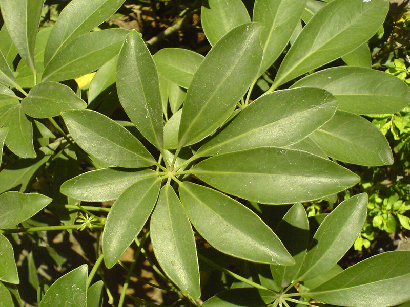

# Schefflera arboricola - Dwarf umbrella tree

[TOC]

Schefflera arboricola (syn. Heptapleurum arboricolum) is a flowering plant in the family Araliaceae, native to Taiwan as well as Hainan. Its common name is dwarf umbrella tree, as it appears to be a smaller version of the umbrella tree, Schefflera actinophylla.

## Description
It is an evergreen shrub growing to 8–9 m tall, free-standing, or clinging to the trunks of other trees. The leaves are palmately compound, with 7–9 leaflets, the leaflets 9–20 cm long and 4–10 cm broad (though often smaller in cultivation). The flowers are produced in a 20 cm panicle of small umbels, each umbel 7–10 mm diameter with 5–10 flowers.

## Uses
The umbrella plant lends itself easily to the bonsai form and is popular as an indoor bonsai.

It is commonly grown as a houseplant, popular for its tolerance of neglect and poor growing conditions. It is also grown as a landscape plant in milder climates where frosts are not severe.

## Common name
* **English** -  Dwarf umbrella tree

## References

## External Links
* [Schefflera arboricola](https://en.wikipedia.org/wiki/Schefflera_arboricola)

## References

1. [arboricola"]("Schefflera)(http://www.efloras.org/florataxon.aspx?flora_id=2&taxon_id=200015275). Flora of China. Missouri Botanical Garden, St. Louis, MO & Harvard University Herbaria, Cambridge, MA. Retrieved 14 March 2013.
2. **Dinesh Valke. Photograph of *Schefflera arboricola*. Flickr, CC BY 2.0.** [Source](https://www.flickr.com/photos/dinesh_valke/368807186)
