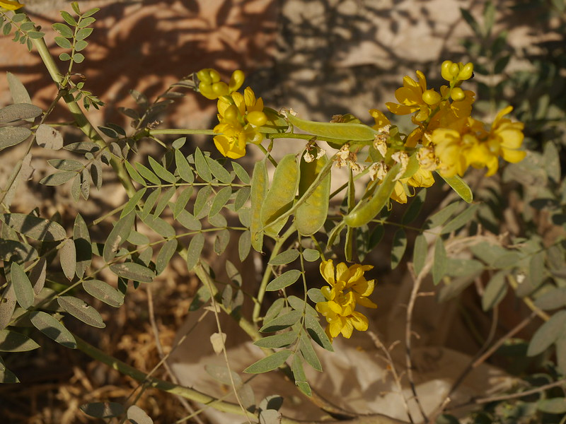

# Senna alexandrina - Senna, ಸೋನಾಮುಖಿ, Senay, Nelavirai, Nelahonne, Swarnapatri

[TOC]

**Senna alexandrina** is a perennial shrub of the family Fabaceae, growing up to 1.8 m in height. It has compound leaves with 3-9 pairs of leaflets that are greenish-blue when fresh, turning yellow-green at maturity. The plant produces yellowish flowers and flat pods containing 5-7 kidney-shaped seeds. It is widely cultivated in semi-arid regions for its leaves and pods, which are used as a natural laxative.

## Uses
Constipation, Liver disorders, Blood purification, Digestive disorders, Kidney and urinary disorders.

## Parts Used
Leaves, Pods (Fruits).

## Chemical Composition
The leaves and pods contain sennosides (anthraquinone glycosides), primarily sennoside A and sennoside B, which are the active laxative compounds.

## Common names
| Language | Names |
| --- | --- |
| Kannada | ಸೋನಾಮುಖಿ Sonamukhi |
| Sanskrit | Swarnapatri |
| Hindi | Senay |
| Tamil | Nelavirai |
| Telugu | Nelahonne |
| English | Senna, Alexandrian Senna, Tinnevelly Senna |

## Properties
Reference: Dravya - Substance, Rasa - Taste, Guna - Qualities, Veerya - Potency, Vipaka - Post-digesion effect, Karma - Pharmacological activity, Prabhava - Therepeutics.
### Dravya
### Rasa
Tikta (Bitter)
### Guna
Laghu (Light), Ruksha (Dry)
### Veerya
Ushna (Hot)
### Vipaka
Katu (Pungent)
### Karma
Rechaka (laxative), Bhedana (purgative)
### Prabhava

## Habit
Shrub

## Identification
### Leaf
Compound, paripinnate, with 3-9 pairs of ovate-lanceolate leaflets, 1.5-5 cm long and 0.4-2 cm wide.

### Flower
Yellow, in axillary racemes.

### Fruit
Flat pod, 3.5-6.5 cm long, containing 5-7 flat kidney-shaped seeds.

### Other features

## List of Ayurvedic medicine in which the herb is used

## Where to get the saplings
## Mode of Propagation
Seeds.

## How to plant/cultivate

Perennial shrub (up to 1.8 m) suited for semi-arid to arid climatic conditions. Grows in sandy loam and gravelly soil; pH 7-8.5. Suited for rainfed and irrigated conditions. Propagated through **seeds** (2 kg per hectare). Sow 110-115 days before main harvest. Plant in rows at 30 cm spacing; thin to 4-5 cm between plants at 15 days. Can be rainfed; provide 5-8 irrigations during prolonged dry spells. Weed at 25-30 days and 75-80 days after sowing. Pests: stem borer, caterpillars, pod borer. Diseases: leaf blight, powdery mildew, stem rot. Use neem seed kernel extract at 15-day intervals. First leaf harvest at **50-90 days**; second at 90-100 days; third at 130-150 days. 3 harvests per year. Dry leaves in shade. Pods collected when brown at 10-12 days after maturity. Yield: 15 quintals dry leaves and 7 quintals pods per hectare per year. Economics: Rs. 25-50/kg; net profit Rs. 50,000-80,000 per hectare. Varieties: Sona, Gujarat Anand Senna-1, KKM-Sel 1.

## Commonly seen growing in areas
Semi-arid regions, Sandy soils.

## Photo Gallery

## References

1. **[KAMPA - ಔಷಧಿ ಸಸ್ಯಗಳ ಕೃಷಿ ಕೈಪಿಡಿ (Medicinal Plants Cultivation Handbook)](../resources/books/KAMPA_Medicinal_Plants_Cultivation_Handbook.md)**. Karnataka Medicinal Plants Authority (KAMPA), Bengaluru, 2024, pp. 89-92.
   Cultivation details including soil requirements, propagation methods, planting, irrigation, harvest timing, yield estimates, and economics.

## External Links
2. **Dinesh Valke. Photograph of *Senna alexandrina*. Flickr, CC BY 2.0.** [Source](https://www.flickr.com/photos/dinesh_valke/44909330024)
