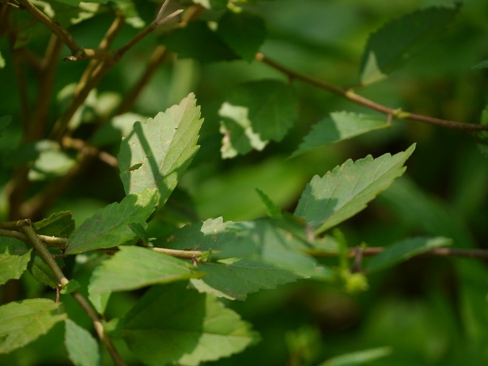

# Sida acuta - Common Wireweed, Bheemana kaddi, Baraira, Arivaḷmanaip puṇṭu, Muttavapulagamu, Malatanni Shiruparuva

[TOC]

**Broom weed** is a much-branched, perennial plant producing somewhat woody stems 1 - 2 metres tall from a woody rootstock. The plant is harvested from the wild as a local source of medicines and fibre. This plant is belongs to Malvaceae family.
## Uses
Fevers, Dysentery, Wounds, Headache, Headache, Toothache, Parasites, Body fatigue, Reproductive disorders, Numbness, Paralysis, Rheumatic joint pain, Inflammation, Edema, Urinary disorders, Digestive complaints.

## Parts Used
Bark, Stems, Leaves, Young twigs.

## Chemical Composition
It contains three types of alkaloidal constituents, viz., beta-phenethylamines, quinazolines and carboxylated tryptamines, in addition to choline and betaine have been isolated from Sida acuta Burm.

## Common names
| Language | Names |
| --- | --- |
| Sanskrit | Baraira, Bala, Rajabala, Pranajeevika, Vatsalika, Vatta |
| English | Common Wireweed, Morning mallow, The Horn Beam Leaves Sida |
| Hindi | Baraira, Vireta, Bariyar |
| Kannada | Bheemana kaddi, Dodda Bindige Gida, Vishakaddi |
| Malayalam | Malatanni Shiruparuva |
| Tamil | Arivaḷmanaip puṇṭu, Pajapasi, Malaitangi |
| Telugu | Muttavapulagamu, Chittamu, Chittamutta, Vishayodhi |

## Properties
Reference: Dravya - Substance, Rasa - Taste, Guna - Qualities, Veerya - Potency, Vipaka - Post-digesion effect, Karma - Pharmacological activity, Prabhava - Therepeutics.
### Dravya
### Rasa
### Guna
### Veerya
### Vipaka
### Karma
### Prabhava
## Habit
Shrub

## Identification
### Leaf

### Flower
### Fruit
### Other features
## List of Ayurvedic medicine in which the herb is used
## Where to get the saplings
## Mode of Propagation
Seeds

## How to plant/cultivate

## Commonly seen growing in areas
On Roadsides, On Wastelands.

## Photo Gallery

## References

## External Links
* [Sida acuta on keyserver.lucidcentral.org](https://keyserver.lucidcentral.org/weeds/data/media/Html/sida_acuta.htm)
* [Sida acuta on cabi.org](https://www.cabi.org/isc/datasheet/49985)
* [Sida acuta on indiabiodiversity.org](https://indiabiodiversity.org/species/show/231114)

## References

1. [constituents](Chemical)(https://pubmed.ncbi.nlm.nih.gov/17402065/#:~:text=Three%20types%20of%20alkaloidal%20constituents,rhombifolia%20L.%2C%20and%20S.)
2. [Morphology]
3. [Cultivation]
4. Indian Medicinal Plants by C.P.Khare
5. [names](Local)(http://www.flowersofindia.net/catalog/slides/Common%20Wireweed.html)
6. **Gurudeva, Magadi R. *Karnatakada Aushadhiya Sasyagalu*. Divyachandra Prakashana, Bengaluru, 2017, p. 277.**
   1. Consuming the root or leaf decoction helps repel insects and parasites from the body. 2. Applying root paste on wounds and sore areas helps promote healing. 3. Consuming the root decoction helps relieve body fatigue and enhances physical strength and vitality. It has nerve-tonic properties (Naapu.
7. **Daitota, P. S. Venkatarama. *Auṣadhīya Sasyagaḷu (ಔಷಧೀಯ ಸಸ್ಯಗಳು; Medicinal Plants)*. Vivekananda Samshodhana Kendra, Vivekananda Vidyavardhaka Sangha, Puttur, 2016, p. 360.**
   Medicinal uses as mentioned in Daitota's Auṣadhīya Sasyagaḷu: presented as a renowned remedy for recurrent fevers (āvarta jvara). The author identifies the plant with the classical Sanskrit Balā — the four-Bala group (Bala, Atibala, Mahābala, Nāgabala) used in Ayurveda as a major nervine tonic, anti-inflammatory and vāta-pacifier. Whole plant and root used.
   > *As cited in: Balā — classical Ayurvedic standing in the four-Bala group (no specific text/verse cited)*
8. **Dinesh Valke. Photograph of *Sida acuta*. Flickr, CC BY 2.0.** [Source](https://www.flickr.com/photos/dinesh_valke/48847146241)
